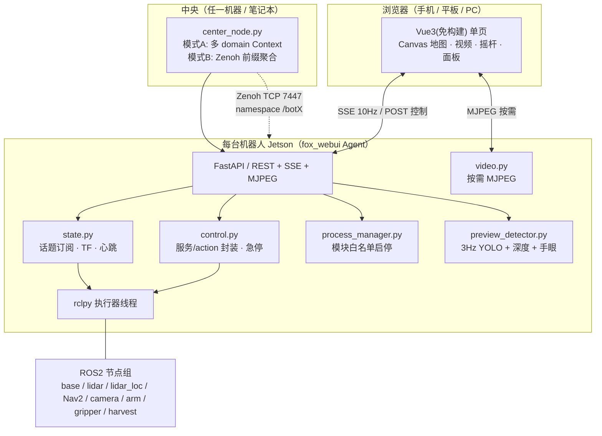
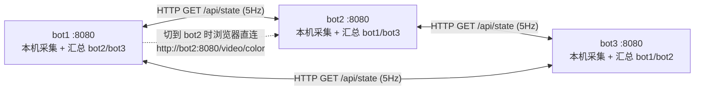

# FOX 葡萄采摘机器人 WebUI — 技术文档

> 版本：v1.1（2026-09-30）
> 配套文档：[WebUI 任务清单](WebUI_任务清单.md)（施工步骤 + 每步验证）
> 读者：需要理解/维护/接手这套 WebUI 的开发者、现场调试人员
>
> **v1.1 变更**：多机方案定稿为 **模式 C（对称 HTTP 聚合）** —— 每台机都跑 Agent，各机之间用 HTTP
> 互拉 `/api/state`，因此**任意一台的 `:8080` 都能看到全部机器**。新增 §3.2 四形态对照、§5.2 聚合伪代码、
> **§7.4 模式 C 详解**、§11.4 启动方式；原"模式 A（多 domain）/模式 B（Zenoh）"降级为可选形态。

---

## 1. 为什么做这个（需求与范围）

### 1.1 现状痛点

现在这台葡萄采摘机器人（ROS2 Humble + Jetson Orin Nano）的所有操作都散落在终端里：

| 想干的事 | 现在的做法 |
|---|---|
| 看机器人在哪 | `ros2 run tf2_ros tf2_echo map base_link` |
| 看机械臂位置 | `ros2 topic echo /arm_controller/position_info` |
| 看电池 | `ros2 topic echo /car_data`（在一堆字段里找 `power_voltage`） |
| 看相机识别 | 在 VNC 里开 RViz / 看图 |
| 导航到某处 | 手敲 `ros2 action send_goal ... "{pose: {...}}"` 一长串 JSON |
| 开始采摘 | `ros2 launch fox_grape_harvest full_system.launch.py`（**启动即自动开始，无法中途介入**） |
| 夹爪开合 | `ros2 service call /gripper/grip std_srvs/srv/SetBool "{data: false}"` |

问题：**不直观、要记命令、多台机器人时四处切换、无法用手机操作、无法一屏纵览**。

### 1.2 目标（要做什么）

做一个网页界面（手机/平板/PC 浏览器打开即用），把"看"和"控"集中到一屏：

| 类别 | 功能 |
|---|---|
| **看** | 机械臂末端 XYZ、电池电压/充电状态、地图中的坐标与朝向、夹爪开合、底盘线速度/角速度、相机实时画面（彩色/深度/识别叠加）、检测到的葡萄列表与坐标、模块健康、日志 |
| **控** | 一键启停各硬件模块（导航/相机/机械臂/夹爪/采摘）、手动底盘控制（摇杆/键盘/急停）、导航（点地图/选航点/取消/返航）、机械臂（goto/相对微调/home）、夹爪（抓紧/松开）、触发采摘任务（全流程 or 单颗点选） |
| **多机** | 手机热点下同时监控多台机器人，一屏切换与总览 |
| **非功能** | 直观、简洁、不拖慢原有导航/采摘；断线自动报警；危险操作需二次确认 |

### 1.3 非目标（明确不做，避免范围膨胀）

- 不做标定功能（标定仍用 `src/calibration`、`hand_eye_calib.py`）。
- 不替代 RViz/Foxglove（3D 调试仍可用它们；WebUI 只做"直观可控"）。
- 不做云端/公网服务（局域网/热点内使用，无鉴权）。
- 不重写 YOLO/深度/手眼算法（**复用** `fox_grape_harvest` 的现有实现）。

---

## 2. 系统背景（读代码前必须知道的）

### 2.1 硬件与软件栈

| 项 | 内容 |
|---|---|
| 计算 | Jetson Orin Nano，Ubuntu 22.04，ROS2 **Humble** |
| 底盘 | 三轮全向（`rei_robot_base`，C++ 节点 `rei_base`，串口 `/dev/ttyUSB1`，需 `REI_ROBOT=fox_three`） |
| 机械臂 | uArm Swift Pro（`arm_controller`，C++ 节点 `arm_swiftpro`，`/dev/ttyACM0`，G-code） |
| 夹爪 | 众灵总线舵机（`gripper_control`，Python 节点 `gripper_node`，`/dev/ttyGripper`，CH340） |
| 相机 | Orbbec Astra Pro Plus（彩色 + 深度，硬件 D2C 会崩，用**手动 D2C**） |
| 雷达 | ydlidar（`/dev/ydlidar`，话题 `/scan`） |
| 定位 | **`lidar_loc`**（激光势场爬山匹配，**替代 AMCL**），发布 `map→odom` TF 与 `/lidar_loc_pose` |
| 导航 | Nav2（planner/controller/bt_navigator/behavior_server + lifecycle_manager） |
| 建图 | Cartographer（`fox_slam_ros2`） |
| 视觉抓取 | `fox_grape_harvest`：`harvest_node` 主流程、`yolo_detector`、`depth_utils`（深度→相机3D→机器人系） |

### 2.2 TF 树（决定了"机器人在地图里的坐标"怎么算）

```
map ──(lidar_loc 30Hz)──> odom ──(rei_base 50Hz)──> base_footprint ──> base_link ──> ... ──> front_lidar_link
```

**要显示"机器人在地图里的坐标"，正确做法是查 TF `map → base_footprint`**，而不是读 `/odom`（那是相对里程计，会漂）。`/lidar_loc_pose` 是同一信息的现成话题，可作兜底。

### 2.3 关键接口全清单（WebUI 的"数据源"和"操作面"）

#### 话题（订阅）

| 话题 | 类型 | 频率 | WebUI 用途 |
|---|---|---|---|
| `/odom` | `nav_msgs/Odometry` | 50Hz | 实测线速度 `twist.linear.x/y`、角速度 `twist.angular.z` |
| `/cmd_vel` | `geometry_msgs/Twist` | 不定 | 显示"当前速度指令"（区别于实测） |
| `/car_data` | `rei_robot_base/msg/CarData` | 50Hz | **电池** `power_voltage`、`is_charge`、`motor_speed[]`、`crash[]`、`cliff[]`、`smoke`、`ultrasound[]` |
| `/arm_controller/position_info` | `arm_controller/msg/Control` | 10Hz | **机械臂末端位姿**：`position{x,y,z}` + `roll/pitch/yaw`（mm 单位） |
| `/lidar_loc_pose` | `geometry_msgs/PoseWithCovarianceStamped` | 30Hz | 地图位姿兜底 |
| `/map` | `nav_msgs/OccupancyGrid` | 1Hz(latched) | 地图底图（也可直接读 `maps/*.yaml`+PGM） |
| `/scan` | `sensor_msgs/LaserScan` | 10Hz | 地图上叠加激光点 |
| `/plan` | `nav_msgs/Path` | 1Hz | 全局路径（绿线） |
| `/local_plan` | `nav_msgs/Path` | 10Hz | 局部路径（蓝线） |
| `/camera/color/image_raw` | `sensor_msgs/Image` | 30Hz | 彩色视频 |
| `/camera/depth/image_raw` | `sensor_msgs/Image` | 30Hz | 深度（**`16UC1` 单位 cm**） |
| `/camera/color/camera_info` | `sensor_msgs/CameraInfo` | 30Hz | 内参（fx≈607） |
| `/grape_harvest/debug_image` | `sensor_msgs/Image` | 仅采摘中 | 主流程自带的可视化 |
| `/rosout` | `rcl_interfaces/msg/Log` | 不定 | 日志面板 |
| `/grape_harvest/status` | （**新增**） | 2Hz | 采摘任务阶段/进度 |

#### 服务（调用）

| 服务 | 类型 | 用途 |
|---|---|---|
| `/goto_position` | `arm_controller/srv/Move` | 机械臂绝对移动；**请求体**：`pose`（`arm_controller/Control` = `position{x,y,z}` + `roll/pitch/yaw`）；响应 `success` + `message` |
| `/relative_position` | `arm_controller/srv/RelativePos` | 相对移动：`dx/dy/dz`（mm） |
| `/home` | `std_srvs/SetBool` | 回安全位 (200, 0, 150) |
| `/unlock` | `std_srvs/SetBool` | 解锁电机（可手扳）——**危险，二次确认** |
| `/set_zero` | `std_srvs/SetBool` | 当前位置设为零点——**危险，二次确认** |
| `/gripper/grip` | `std_srvs/SetBool` | 夹爪：`true`=抓紧(pulse 2000)、`false`=松开(500)，动作 1500ms |
| `/gripper/state` | （**新增**） | 夹爪状态回读（脉宽/开度） |
| `/reset_odom` | `std_srvs/Empty` | 里程计清零 |
| `/set_buzzer` | `std_srvs/SetBool` | 蜂鸣器（可用于"找到我"） |

#### Action（动作）

| Action | 类型 | 用途 |
|---|---|---|
| `/navigate_to_pose` | `nav2_msgs/action/NavigateToPose` | 导航到 map 坐标点（可取消，可反馈剩余距离） |

### 2.4 项目已知坑（WebUI 必须绕开或兼容）

| 坑 | 影响 | WebUI 对策 |
|---|---|---|
| 深度是**厘米**（`16UC1`，实测 50cm→读数 50） | 深度显示/换算差 10 倍 | 统一 `/100`，并在文档/回归用例里锁定（任务清单 T2.3） |
| 改 `src` 不重编不生效（ament 把脚本装到 `install/<pkg>/lib/`） | "改了没效果" | 所有改动流程都要求 `colcon build`，验证步骤里显式检查 `install` 副本 |
| 相机内参靠 `color_info_url` 决定 | 内参错 → 手眼、像素→3D 全错 | 模块启动配置里**固化** `color_camera_info.yaml`；启动后验证 `fx≈607` |
| ydlidar 端口被占报 `Unknown error` | 雷达起不来 | 启动前 `pkill -f ydlidar` |
| Nav2 `server_timeout` 单位是**毫秒**（默认 20ms，Jetson 上必超时） | 给目标点不动 | 不重复配置；只做"现象对照表"引导排查 |
| `harvest_node` 启动即自动跑（2s 定时器） | 无法受控 | 改 `start_on_boot:=false` + 触发服务（任务清单 T3.6） |
| 夹爪无状态发布 | 界面无法显示开合 | 新增 `/gripper/state`（T1.3） |
| 机械臂工作空间 `X[30,335] Y[-190,190] Z[20,220]` | 越界目标被驱动"螺旋就近修正"到别处 | 后端**前置拦截**越界值，界面明确提示 |
| 定位需先给初始位姿（`lidar_loc` 与 AMCL 相同） | 无 `map→base_footprint` 时地图是空白/不动 | 界面提示"请先给初始位姿"，并提供"设初始位姿"入口（发 `/initialpose`） |

---

## 3. 总体架构

### 3.1 架构图



### 3.2 四种部署形态（同一套代码）

| 形态 | 说明 | 适用 |
|---|---|---|
| **单机** | 只跑 Agent，浏览器直连该机 8080 | 平时调试、单台作业 |
| **多机 · 模式 C**（⭐ 推荐） | **每台机都跑 Agent**，并配一份 `peers` 邻居名单，各机之间用 **HTTP** 互拉 `/api/state` → **任意一台的 8080 都能看到全部机器** | 3~5 台、同一 WiFi/局域网（**只要 HTTP 通，不依赖多播**） |
| **多机 · 模式 A** | 中央进程开 N 个 `rclpy.Context`（各绑一个 `domain_id`），**一进程订阅多台** | 所有机器在同一热点/网段且多播可用；只想要"一台中心看全部" |
| **多机 · 模式 B** | 每机一条 `zenoh-bridge-ros2dds`（带 `namespace:/botX`），中央一条桥接入 | 跨网段、热点屏蔽多播、机器分散 |

三种多机形态的根本差别只有两点：**聚合发生在哪一层**、**拓扑是"中心式"还是"对称式"**。

| | 模式 C（对称 HTTP）⭐ | 模式 A（多 domain） | 模式 B（Zenoh） |
|---|---|---|---|
| 聚合层次 | **HTTP / 应用层** | DDS 层 | DDS/Zenoh 层 |
| 拓扑 | **对称全互联**（每台都是中心） | 中心—辐射 | 中心—辐射 |
| 每台都要装 webui 吗 | **要**（每台跑 Agent） | 不要（只装中央） | 不要（只装中央，另装桥） |
| 谁能看到全部 | **每台都能** | 只有中央 | 只有中央 |
| 跨机视频 | **天然**（浏览器直连对方 `:8080/video/...`） | 难（图像跨网 DDS 太重） | 一般（桥转大流量） |
| 派生的网络要求 | 只要 **HTTP 通** | 同网段 + **多播可用** | 需部署 Zenoh 桥 |
| 控制怎么跨机 | 转发 HTTP 指令给该机 Agent（**本机** rclpy 执行） | 直接发 DDS action | 靠桥转 action（apt 版 0.5.0 有风险） |
| 独立可用性 | ✅ 邻居全挂，本机照常可用 | ❌ 视中央 | ❌ 视中央/桥 |

> ⚠️ **模式 A 与 B 不可同时启用**。Zenoh 官方明确警告：被桥接的两台主机之间若还存在 DDS 通信，会产生**重复/回环流量**。切换用后端 `--mode lan|zenoh` 一个开关控制。
>
> ✅ **模式 C 不受该限制**（跨机完全不经过 DDS）。文档的分层不变量——"**业务逻辑放 Agent、Center 只做聚合**"（见 §7.2 末）——正是模式 C 的立论基础：C 把这条"HTTP 指令兜底路径"从兜底升格为**主路径**。

### 3.3 关键技术决策与理由（为什么这么选）

| 决策 | 备选 | 为什么选它 |
|---|---|---|
| **自研 Python 后端（rclpy）+ 自研前端** | rosbridge_suite + roslibjs；Foxglove Studio | rosbridge 已装但前端逻辑要自己写，且 JSON 序列化开销大、图像走不通；Foxglove 是通用工具，做不出"葡萄采摘一键流程"。自研可控、零额外运行时、能直接复用 `depth_utils` 等业务代码 |
| **Zenoh（`zenoh-bridge-ros2dds`）做跨机汇聚** | 纯 DDS 多播；rosbridge | 手机热点常屏蔽多播/NAT 隔离 → DDS 不可靠；Zenoh 走 **TCP 单播**、支持 **命名空间前缀**（多机天然隔离）、`actions` 也能跨桥（桥内映射为 Zenoh queryables）。apt 一装即用 |
| **每机独立 `ROS_DOMAIN_ID` + `ROS_LOCALHOST_ONLY=1`** | 统一 domain + 话题命名空间 | 现有话题名是绝对路径（`/cmd_vel`、`/odom`），改名要动全部 launch → 风险大；换 domain 零改动，且满足 Zenoh "两主机间不能有 DDS 通信"的要求 |
| **单进程多 `rclpy.Context` 实现"一屏多机"** | 每机一个后端进程 | Humble 的 `rclpy.init(context=ctx, domain_id=N)` 已核实支持（`rclpy/__init__.py:69`）→ 一个进程一个前端就能聚合多机，运维最简 |
| **多机主推模式 C：各机 Agent 之间用 HTTP 互拉状态** | 模式 A 多 domain；模式 B Zenoh 桥；rosbridge | ① 不依赖**多播**（手机热点常屏蔽）→ 只要 HTTP 通；② 不依赖 Zenoh 桥的 action 转发能力（apt 版仅 0.5.0，有风险）；③ **视频天然可跨机**（浏览器直连对方 Agent，不走 DDS）；④ 每台机**独立可用**（邻居/中心挂了不影响现场）；⑤ 复用现有 Agent 全部代码，只加一个采集线程 |
| **前端 Vue3 ESM 浏览器版 + Three.js（免构建）** | Vite/Webpack 构建工程；纯原生 JS | Vue3 提供 `vue.esm-browser.prod.js`（`importmap` 直接用），Three.js 同样是 ESM 单文件 → **开发体验接近工程化，但零 npm、零构建、离线可跑**（现场机器人常无外网） |
| **视频 MJPEG 而非 WebRTC/H.264** | WebRTC / H.264 | MJPEG 实现最简单（`` 直出）、CPU 可接受（按需、10fps、q70）；H.264/WebRTC 需要额外编解码与信令，收益不匹配当前需求 |
| **先 2D Canvas，后 Three.js** | 直接 3D | 2D 就能满足"直观看位置/路径/激光"；3D 开发与算力成本高，放后期增强 |
| **状态用 SSE + 控制用 POST** | 全 WebSocket | 状态是单向流，SSE 更简单（浏览器原生 `EventSource`、自动重连）；控制是请求-响应，REST 语义清晰、易调试（`curl` 即可测） |

---

## 4. 数据映射：界面每一块数据从哪来

| UI 元素 | 数据源 | 处理 |
|---|---|---|
| 机械臂 XYZ | `/arm_controller/position_info` | 直接取 `position`（mm），保留 1 位小数 |
| 机械臂姿态 | 同上 | `roll/pitch/yaw`（度） |
| 电池电压 | `/car_data.power_voltage` | 直接显示 V，<20V 预警色（阈值可配） |
| 充电中 | `/car_data.is_charge` | 显示充电图标 |
| 底盘线速度 | `/odom.twist.twist.linear.x/y` | 显示 m/s（实测） |
| 底盘角速度 | `/odom.twist.twist.angular.z` | 显示 rad/s |
| 当前速度指令 | `/cmd_vel` | 与实测并列显示，便于区分"发了没走" |
| 地图坐标/朝向 | TF `map→base_footprint` | 位置 m，朝向由四元数转 yaw 再转度 |
| 地图底图 | `maps/*.yaml` + `.pgm`（或 `/map`） | 解析 `resolution/origin`，转成 Canvas 像素 |
| 激光点 | `/scan` | 极坐标 → 世界坐标（用激光位姿，或简化为机器人位姿 + 帧偏移） |
| 全局路径 | `/plan` | 折线绘制 |
| 夹爪开合 | `/gripper/state`（新增） | 脉宽→开度%：`(2000-pulse)/(2000-500)`，**2000=抓紧** |
| 彩色/深度画面 | `/camera/color/image_raw`、`/camera/depth/image_raw` | 深度 `16UC1` **cm → `/100` 得米**，伪彩归一化 |
| 识别框/坐标 | `preview_detector`（新增） | YOLO → 深度 → 手动 D2C → 手眼 → 机器人系 mm；可抓性用 `depth_utils.classify_reach` |
| 采摘阶段/进度 | `/grape_harvest/status`（新增） | 阶段枚举 + 航点索引 + 计数 |
| 模块健康 | 各话题"最后收到时间" | 超 3s 判掉线；频率用滑动窗口估算 |
| 日志 | `/rosout` | 级别过滤 + 环形缓冲 |

---

## 5. 后端设计

### 5.1 线程模型（最容易写错的地方）

```
主线程            : uvicorn / FastAPI（asyncio 事件循环，处理 HTTP/SSE/MJPEG）
线程 A（1 个）     : rclpy Executor #1 —— 订阅所有本机话题 + TF 监听 + 服务/action 客户端
线程 B（0..N 个）  : 模式 A 时每多一个 domain 追加一个 Executor 线程
线程 B'（1 个）    : 模式 C 的 peers 采集线程（HTTP 拉邻居 /api/state，默认 5Hz）
线程 C（1 个，可选）: preview_detector 检测循环（3Hz，可开关）
线程 D（每流 1 个）: video.py 的 MJPEG 生成器（仅在有观看者时存活）
线程 E（每模块 1 个）: process_manager 的日志读取线程（阻塞读子进程 stdout）
```

**核心解耦原则：ROS 线程只写"快照"，Web 线程只读"快照"。**

```python
# state.py —— 用一把锁保护一个普通 dict，避免跨线程调用 asyncio
class StateStore:
    def __init__(self):
        self._lock = threading.Lock()
        self._data = {'ts': 0.0, 'robots': {}}      # 多机时为 {'bot1': {...}}

    def update(self, patch: dict):                  # 由 ROS 回调线程调用（高频）
        with self._lock:
            self._data.update(patch)
            self._data['ts'] = time.time()

    def snapshot(self) -> dict:                     # 由 Web 线程调用
        with self._lock:
            return copy.deepcopy(self._data)
```

```python
# webapi.py —— SSE：Web 线程按固定频率读快照，不做任何 ROS 调用
@app.get("/api/stream")
async def stream():
    async def gen():
        while True:
            yield f"data: {json.dumps(store.snapshot())}\n\n"
            await asyncio.sleep(0.1)     # 10Hz
    return StreamingResponse(gen(), media_type="text/event-stream")
```

这样设计的好处：① 不需要 `asyncio.run_coroutine_threadsafe` 之类的跨线程调度；② 高频 ROS 回调不会阻塞 HTTP；③ 前端天然"合并渲染"，不会因 50Hz 话题刷爆 DOM。

### 5.2 多机状态聚合

模式 A（单进程多 domain）伪代码：

```python
# center_node.py
def _start_domain(domain_id: int, name: str):
    ctx = Context()
    rclpy.init(args=None, context=ctx, domain_id=domain_id)   # Humble 已核实支持
    node = Node(f'webui_{name}', context=ctx)                  # 节点名带前缀，避免重名
    sub = RobotStateCollector(node, name)                      # 采集该机状态 → store['robots'][name]
    ex = SingleThreadedExecutor(context=ctx)
    ex.add_node(node)
    threading.Thread(target=ex.spin, daemon=True).start()

for d, name in zip(cfg.domains, cfg.robot_names):
    _start_domain(d, name)
```

模式 B（Zenoh）时，中心只需 **1 个 domain**，话题带前缀：订阅 `/bot1/odom`、`/bot2/odom`…（前缀由各机桥的 `namespace` 加，含 `/tf`、`/rosout`）。

**模式 C（对称 HTTP，⭐ 推荐）**：**每个 Agent 进程 = 本机采集 + 邻居汇总**，聚合发生在 HTTP 层，不碰 DDS：

```python
# peers.py —— 邻居采集线程（每个 Agent 进程各跑一份）
class PeerAggregator:
    def __init__(self, me: str, peers: list[dict], store, hz: float = 5.0):
        self.me, self.peers, self.store, self.hz = me, peers, store, hz

    def run(self):                                   # 独立 daemon 线程，不碰 rclpy
        while not self._stop.is_set():
            for p in self.peers:                     # 只拉一层，绝不递归 → 天然防环
                try:
                    r = requests.get(p['url'] + '/api/state', timeout=1.0)
                    self.store.update_robot(p['name'], r.json())     # → store['robots'][name]
                except Exception:
                    self.store.mark_offline(p['name'])               # 掉线标灰，不抛异常
            time.sleep(1.0 / self.hz)                # 邻居状态不需要 10Hz，5Hz 足够
```

要点：
- **只拉邻居的 `/api/state`，不拉"邻居的邻居"** → 拓扑恒为**一层星形**，不存在递归放大；
- 邻居掉线只是把该机标"掉线"，**不影响本机页面**（本机数据走本机 ROS，独立于邻居）；
- 本机数据由 ROS 回调线程高频写入 `store`，邻居数据由采集线程低频覆盖，合并后由**同一个 SSE** 推给浏览器；
- 前端只多一个"机器下拉"，`/api/state` 结构向后兼容（多一层 `robots` 映射）；
- **控制不跨机走 DDS**：切到 bot2 时，浏览器把控制请求发到**本机 Agent**，本机 Agent 再 `POST` 给 bot2 的 Agent（bot2 用**它自己的** rclpy 执行）→ 每台 Agent 永远只操作本机实体，最稳。

> `peers` 采集线程只用 `requests`（HTTP），**绝不碰 rclpy** —— 与"ROS 实体只能在 executor 线程创建/销毁"（§5.3 铁律）无关，因此不会引入死锁。

### 5.3 按需 MJPEG（不看不耗电）

```python
# video.py
class VideoBroker:
    def __init__(self):
        self._subs = {}          # src -> rclpy.Subscription
        self._refs = defaultdict(int)
        self._lock = threading.Lock()

    def frame(self, src: str):
        """生成器：请求订阅 → 逐帧 yield JPEG → 结束时退订"""
        self._acquire(src)
        try:
            while True:
                img = self._latest[src].wait_new()          # 阻塞等新帧（带超时）
                ok, buf = cv2.imencode('.jpg', img, [cv2.IMWRITE_JPEG_QUALITY, 70])
                if ok:
                    yield b'--frame\r\nContent-Type: image/jpeg\r\n\r\n' + buf.tobytes() + b'\r\n'
        finally:
            self._release(src)                              # 引用计数归零 → 销毁订阅

@app.get("/video/{src}")
def video(src: str):
    return StreamingResponse(
        VideoBroker.frame(src),
        media_type='multipart/x-mixed-replace; boundary=frame')
```

要点：
- 浏览器 `` 即可显示，无需 JS。
- **引用计数归零即退订**，无观看者时 CPU 近零（这是"WebUI 不影响导航"的关键）。
- 深度源在做伪彩时按 `v/100.0`（cm→m），截断 0.2~2.5m 后归一化上色。

#### ⚠️ 必须用**异步**生成器（线程池泄漏的真实事故）

最初把 MJPEG 写成普通同步生成器（`def stream()` 里 `yield`），交给 Starlette 处理 ——
结果踩了一个坑：**同步生成器会被丢进 AnyIO 线程池，而一个永不结束的流会永久占用一个池线程**。
客户端断开时（关标签页/网络断/curl 超时），Starlette 无法中断阻塞在取帧上的线程，
于是线程泄漏；反复开关几次视频后线程池耗尽，
**连 `/api/ping` 这种只读内存的接口都排队卡死**（实测：agent 70% CPU、完全无响应）。

修正后的写法（实测稳定）：

```python
async def _stream_impl(self, name, st):
    period = 1.0 / self.fps
    try:
        while True:
            frame, seq = st.slot.latest()          # 非阻塞取当前帧
            if seq == last_seq:                    # 没新帧 → 让出事件循环
                await asyncio.sleep(period)
                continue
            jpg = await asyncio.to_thread(self._encode, frame)   # 编码短暂借线程，会归还
            yield b'--frame\r\n...' + jpg + b'\r\n'
            await asyncio.sleep(period)
    finally:
        self._release(name)                        # 取消时一定会跑到 → 正确退订
```

配套措施（都已落地）：
1. **所有读内存的端点都用 `async def`**（`/api/ping`、`/api/state`、`/api/health`、`/api/logs`…），
   否则它们也要排队等线程池。
2. **看门狗**：每 2s 检查一次，若某观看者超过 5s 没取帧，强制回收名额并退订
   （防断网/关标签页造成的幽灵观看者）。
3. **名额满时踢掉最旧的连接，而不是返 503** —— 理由见下面的事故记录。当前上限每源 3 个。

#### ⚠️ 名额被“孤儿观看者”占满 → 视频永久 503（第三个真实事故）

现象：页面在播视频时控制台反复报 `GET /video/color 503`，`/api/health` 的
`video_viewers` 恒为 `{'color': 3}`。只要手动刷新页面几次，视频就**再也打不开**。

排查链条（每一环都实测过）：
1. 初版是“纯引用计数 + 超过上限直接 503”。3 个名额被占住后，第 4 个请求必然 503。
2. 那么是谁占着名额？是**旧页面的流**。浏览器**刷新**时并不会立即断开旧的 MJPEG 请求，
   服务端那边 socket 也不报错（写缓冲还装得下），旧生成器就继续取帧往一个没人读的 socket 写。
3. 为什么断开检测没生效？Starlette 1.6.0 的 `StreamingResponse.__call__` 在
   **ASGI `spec_version >= 2.4`** 时走的是 `await self.stream_response(send)` +
   `except OSError -> ClientDisconnect`，**根本不会调用 `listen_for_disconnect`**。
   而“刷新”场景下不会产生 `OSError`，所以只有“真断连”能被发现。

修复（两处，都在 `video.py`）：

```python
class _Viewer:                      # 每个 MJPEG 连接一个句柄
    __slots__ = ('name', 'stop', 'since', 'last_pull')

def _acquire(self, name):
    with self._lock:
        lst = self._viewers.setdefault(name, [])
        while len(lst) >= self.max_viewers:
            oldest = min(lst, key=lambda v: v.since)
            oldest.stop = True      # 对方下一轮循环会自动退出并归还名额
            lst.remove(oldest)
        v = _Viewer(name); lst.append(v); st.refs = len(lst)
        return v

def _render_jpg(self, name, st, frame, seq):     # 同源同帧只编码一次
    with st.enc_lock:
        if st.enc_jpg is not None and st.enc_seq == seq:
            return st.enc_jpg
    ...
```

效果（`bench_viewers.sh` 实测，假相机 3Hz）：

| 观看者 | agent CPU | RSS |
|---|---|---|
| 0 | 24.0% | 311MB |
| 1 | 26.6% | 318MB |
| 2 | 27.2% | 317MB |
| 3 | 31.2% | 318MB |

连续 `curl` 拉流 6 次全部 200；浏览器连续刷新 4 次全部 200 且 `` 拿到真实 640×480。

#### 🚫 不要用 `request.is_disconnected()` 做断连检测

直觉上很自然的写法（并目同步很诱人）：

```python
# ❌ 实际引起页面卡在 Loading，已回退，不要再加
if await request.is_disconnected():
    return
```

Starlette 的实现是“已取消的 `CancelScope` + `await self._receive()`”：
① 在 `spec_version < 2.4` 的分支下会与 Starlette 自己的 `listen_for_disconnect` **抢同一个 receive 通道**；
② 拿到的 `Cancelled` 属 `BaseException`，`except Exception` 拓不住，会直接抛进生成器。
本项目改用“名额满就踢最旧”的确定性策略，不碰 ASGI 内部。

**已知限制**：刷新留下的孤儿流最长会活到被“第 4 个观看者”顶掉（总量恒 <= 3）。
彻底做法是给观看者加 sid + 前端 2s 心跳、后端 5s 无心跳即回收；本项目当前不实现。

#### ⚠️ 图像回调必须丢帧降频

真机相机是 30Hz、一帧 640×480×3 ≈ 921KB。如果每帧都做一次 `cv_bridge.imgmsg_to_cv2`，
GIL 被占满，后端响应会明显变慢（实测 CPU 70%）。MJPEG 只需要 `fps`（默认 10），
而识别只需 `hz`（默认 3），所以**在转换之前就判断"距上次转换是否够久"，不够就直接 return**：

```python
def _cb(msg):
    now = time.time()
    if now - st.last_conv < self.min_interval:   # 丢帧，不做任何转换
        return
    st.last_conv = now
    img = self.bridge.imgmsg_to_cv2(msg, 'bgr8')
    st.slot.set(img)
```

实测效果：三路流并发下 CPU 从 70.8% 降到 28.5%，且流结束后 `/api/ping` 仍即时响应。

#### ⚠️⚠️ rclpy 实体只能在 executor 线程里创建/销毁（第二个致命事故）

修完上面的线程池问题后仍有一个卡死：**浏览器关页后 agent 整个僵住** —— 进程活着、端口还在 LISTEN，
但 `/api/ping` 无响应，`ss` 看到监听队列 **Recv-Q=20**（连接积压），日志停在
`[video] 回收失联观看者` 之后再无输出。

根因：看门狗是在**自己的线程**里调 `node.destroy_subscription()`，而 rclpy 的实体销毁
与正在 spin 的 executor 竞争 → **死锁**。

**铁律：任何线程都可以读话题数据，但 `create_subscription` / `create_timer` / `destroy_subscription`
只能在 executor 线程（即 ROS timer 回调或话题回调）里做。**

落地做法：把“想做什么”和“真正做”拆开

```python
# 任意线程（asyncio / 看门狗）：只改计数，绝不碰 rclpy
def _acquire(self, name):
    with self._lock:
        st = self._states.setdefault(name, _SourceState())
        st.refs += 1
        return st

# executor 线程（2Hz timer）：按“期望 vs 实际”幂等地同步
def _sync_subscriptions(self):
    for name, st in list(self._states.items()):
        want, have = st.refs > 0, st.subscribed
        if want and not have:  self._do_subscribe(name, st)      # 这里才 create_subscription
        elif not want and have: self._do_unsubscribe(name, st)   # 这里才 destroy_subscription
    # 识别器的启停同样收归到这里（它自己也会订/退订），
    # 而 PreviewDetector.acquire()/release() 只改 refs 计数
```

好处：① 彻底避开跨线程销毁实体的死锁；② 幂等写法天然处理“刚连上又断开”的竞态；
③ 快速切源时不会出现“订了又退错乱”。
修复后实测：开流→断开→12s 后 `/api/ping` 仍即时响应，`Recv-Q=0`。

### 5.4 实时识别（`preview_detector`）

```python
# 复用现有实现，绝不重写，避免双实现漂移
from fox_grape_harvest.yolo_detector import YoloDetector
from fox_grape_harvest.depth_utils import (load_hand_eye_calibration,
                                          load_d2c_config, load_grasp_check,
                                          classify_reach, depth_to_robot_3d_d2c_stable)

while rclpy.ok():
    rgb, depth, K = grab_latest()
    dets = detector.detect(rgb)                      # [(cls, conf, x1,y1,x2,y2), ...]
    for d in dets:
        p_cam = depth_to_robot_3d_d2c_stable(...)    # 手动 D2C（硬件 D2C 会崩）
        p_robot = T_cam_to_robot @ p_cam             # 手眼矩阵（mm）
        level = classify_reach(p_robot, ws_limits, grasp_cfg)   # 0可抓/1临界/2不可达
    publish('/fox_webui/preview_image', draw(rgb, dets, coords))
    store.update({'detections': out})
    time.sleep(0.3)                                   # 3Hz，保护 GPU/CPU
```

为什么要单独做：现有 `/grape_harvest/debug_image` **只在采摘流程中发布**，平时看不到识别效果。这个 3Hz 预览让"操作员看着屏幕就能判断该不该抓"。**深度单位、D2C、手眼全部复用现有代码**，所以坐标与主流程一致（可在任务清单 T2.6 里用 ±2cm 验证）。

### 5.5 模块启停（`process_manager`）

**设计原则：白名单 + 固定参数 + 进程组优雅退出 + 就绪判据。**

```yaml
# config/modules.yaml（节选）
modules:
  base:
    cmd: [ros2, launch, rei_robot_base, base.launch.py]
    env: {REI_ROBOT: fox_three}
    ready: {type: topic, name: /odom, min_hz: 10}
  lidar:
    cmd: [ros2, launch, ydlidar_ros2_driver, ydlidar_launch.py]
    pre: [pkill, -f, ydlidar]                      # 项目已知坑：端口占用
    ready: {type: topic, name: /scan, min_hz: 5}
  nav:
    cmd: [ros2, launch, fox_navigation_ros2, fox_navigation.launch.py, open_rviz:=false]
    # ⚠️ 不要写 requires: [base, lidar] —— fox_navigation.launch.py 自己就
    #    IncludeLaunchDescription(base.launch.py) 并启动了雷达节点。
    #    再要求先手动启动底盘/雷达，反而容易出现"两份底盘/两份雷达"抢串口。
    ready: {type: topic, name: /map}
    # base/lidar 模块的 detect 用**节点名**（robot_base_node / ydlidar_ros2_driver_node）：
    # 这样即使它们是 nav 拉起来的，面板也会认出“外部实例”而不会重复启动。
  camera:
    cmd: [ros2, launch, orbbec_camera, astra_pro_plus.launch.py,
          color_info_url:=file:///home/ubuntu/ros2fox/calib_data/color/color_camera_info.yaml,
          enable_noise_removal_filter:=false, enable_soft_filter:=false,
          enable_threshold_filter:=false, enable_decimation_filter:=false,
          enable_hole_filling_filter:=true]
    ready: {type: topic, name: /camera/color/image_raw, min_hz: 5}
  arm:      {cmd: [ros2, launch, arm_controller, arm_controller.launch.py], ready: {type: topic, name: /arm_controller/position_info, min_hz: 5}}
  gripper:  {cmd: [ros2, run, gripper_control, gripper_node.py], ready: {type: topic, name: /gripper/state}}
  harvest:
    cmd: [ros2, launch, fox_grape_harvest, grape_harvest.launch.py]
    requires: [nav, camera, arm, gripper]
    ready: {type: topic, name: /grape_harvest/status}
```

```python
def start(self, name):
    m = self.modules[name]
    missing = [d for d in m.get('requires', []) if self.state[d] != 'running']
    if missing:
        raise HTTPException(409, f"依赖未启动: {missing}")      # 前端提示"是否一并启动"
    if m.get('pre'):
        subprocess.run(m['pre'], timeout=5)                      # 例如 pkill 残留 ydlidar
    p = subprocess.Popen(m['cmd'], env={**os.environ, **m.get('env', {})},
                         stdout=subprocess.PIPE, stderr=subprocess.STDOUT,
                         start_new_session=True)                 # 独立进程组 → 可整组发信号
    threading.Thread(target=self._pump_log, args=(name, p), daemon=True).start()
    self._procs[name] = p

def stop(self, name, timeout=3.0):
    p = self._procs[name]
    os.killpg(p.pid, signal.SIGINT)          # ros2 launch 对 SIGINT 才优雅退出
    try:
        p.wait(timeout)
    except subprocess.TimeoutExpired:
        os.killpg(p.pid, signal.SIGTERM)
        try: p.wait(2)
        except subprocess.TimeoutExpired: os.killpg(p.pid, signal.SIGKILL)
```

安全要点：
1. **只接受模块名**，命令来自 YAML 白名单，前端**永远不能传命令字符串**（否则等于给了一个远程 shell）。
2. **必须 `start_new_session=True` + `killpg`**：`ros2 launch` 会派生一堆子进程，按单个 PID kill 会留一堆孤儿（这正是本项目"ydlidar 残留导致 Unknown error"的成因之一）。
3. 停止顺序先 `SIGINT`（让 launch 优雅收尾、节点正常 `destroy`、TF/生命周期不残留）。
4. 日志用阻塞读线程 + 环形缓冲，前端按模块过滤查看（相当于把终端搬进网页）。
5. **子进程环境要自己补全**：Agent 是脚本拉起来的（不过 `setup.zsh`），子进程必须显式补齐
   `ROS_DISTRO` / `ROS_VERSION` / `ROS_PYTHON_VERSION` 与 `/opt/ros/humble` 的四条路径，
   否则 `ros2 launch` 会以 `KeyError: 'ROS_DISTRO'` 当场退出（实测：相机模块点一次失败一次）。
6. **就绪判据要分两类话题**：
   * 常驻话题（`/odom`、`/scan`）→ “ROS 图里有 publisher” + “健康表实测频率达标”；
   * **按需订阅话题**（`/camera/color/image_raw` 只在有人看视频时才被订阅）→ 健康表恒为 0Hz，
     拿它比 `min_hz` 会让模块永远停在“启动中”（实测踩过）→ 这时只认 ROS 图。
7. **Agent 重启后的遗留实例要认出来**：因为第 2 条的 `start_new_session`，子进程会在 Agent 退出后活下去，
   而新 Agent 并不知道它们存在 → UI 显示“已停止”，用户再点启动就变成两个相机实例（实测）。
   所以每个模块配一个 `detect` 模式（**遍历 `/proc/*/cmdline` 做子串匹配**），状态会显示“外部实例”并阻止重复启动，
   点“停止”则用普通 `kill`（不能 `killpg`，那不属于我们的会话）清理它。
8. **`status()` 必须便宜**（见下面的“性能铁律”）。

#### ⚠️⚠️ 性能铁律：`status()` 不能做同步的进程扫描（2026-10-01 实测定位）

`ProcessManager.status()` 是本项目**最热**的路径 —— `/api/state` 与 **10Hz 的 SSE** 每次都会调它。
早期实现里它在同步路径上跑 `_refresh_states()`（内部对每个模块 `pgrep` 一次）：

| 测量项 | 实测 |
|---|---|
| `ProcessManager.status()` 一次 | **89.34 ms** |
| └ 其中 8 次 `pgrep` 子进程 | 346 ms（单次 **40 ms**，本机负载下 fork/exec 极慢） |
| × SSE 10Hz | **924 ms/秒 ≈ 92% 的 asyncio 事件循环** |
| 后果 | 事件循环被同步阻塞 → **整页卡顿、连 `/api/ping` 都要排队** |

**修法（两条，都已落地）：**

1. **状态刷新挪到后台 1Hz 线程**（`ProcessManager._start_refresher`）：`status()` 只读缓存
   （实测 **0.001 ms**）；启停/重载后 `_invalidate()` 让缓存立即失效，所以用户点完按钮仍能马上看到新状态。
   刷新只读 `StateStore` 快照与 `/proc`，**不碰 rclpy**，放普通线程是安全的。
2. **不再 `fork pgrep`**：改为纯 Python 遍历 `/proc/*/cmdline` 做子串匹配
   （单次 40 ms → **~1 ms**，且子串比 `pgrep -f` 的正则更精确）。

效果：`status()` **89.34 ms → 0.001 ms**；偶发的同步重建也从 89 ms 降到 33 ms。

> 教训：**任何会被 `/api/state` / SSE 调用的函数，都必须保证是“读内存”级别的开销**。
> 慢活（子进程、文件扫描、网络）一律交给后台线程。

**续集（同日发现）：缓存 TTL 的方向别写反**

第一版把 `_cache_ttl` 写成 `0.9 s`（**小于** 1 s 的刷新周期），注释还写着“正常情况永远命中缓存”—— 实际恰好相反：
每秒都有“缓存刚过期、后台线程还没刷”的窗口，落在窗口里的请求会在**事件循环里同步跑一次 `_rebuild()`**。

| 接口 | p95（TTL 写反时） | 修复后 |
|---|---|---|
| `/api/state` | **1148 ms** | **46 ms** |
| `POST /api/cmd_vel` | **676 ms** | **37 ms** |
| `/api/ping` | 36 ms（不受影响） | 32 ms |

> 诊断技巧：**只有部分接口的 p95 爆掉，就是“那个接口自带周期性慢活”**（ping 干净 → 不是事件循环整体堵）。

正确写法：**TTL ≥ 3 × 刷新周期**（`_cache_ttl = max(2.5, 3.0 / refresh_hz)`），
TTL 只当“后台线程挂了”的兜底。另外 `/proc` 扫描也从“每模块一遍”改成“**每轮一遍**”（`_rebuild` 33 ms → 15 ms）。

#### ⚠️ 速度看门狗的余量（“按住好几秒才动”的真因）

`/cmd_vel` 的“死亡开关”（`cmd_timeout`）原本是 **300 ms**，而端到端固有延迟是：

    前端续期 100 ms + 后端发布周期 100 ms + HTTP 往返（实测最差 ~300 ms）

实测“按住 → 车真的动”= **294 ms**，正好卡在阈值上；一旦某个续期迟到，看门狗就把指令清零 →
**车一顿一顿 / 按住好几秒才有反应**（实测：续期间隔 150 ms 时只有 4/7 采样有速度）。

现改为 **`cmd_timeout: 0.8`（可调）**：容错从 1.5 倍提到 ~4 倍（实测续期到 600 ms 仍连续，850 ms 才正确触发），
而 0.8 s × 0.3 m/s = 24 cm 滑行，“断网即停”的安全性依旧成立。

另外：**`/api/control` 的 `manual.reason` 现在会给出 `renew / timeout / estop`**
（以前只写进 SSE 顶层，前端和排障都拿不到）—— 这是判断看门狗是否在误清零的**权威指标**。

### 5.6 急停状态机

```
     ┌──────────┐  POST /api/estop   ┌────────────┐
     │  normal  │ ─────────────────► │ estopping  │
     └──────────┘                    └────────────┘
          ▲                                │ 依次执行：
          │ POST /api/estop/release        │ 1) 连发 5 次 /cmd_vel 全零
          │ （需二次确认）                  │ 2) cancel /navigate_to_pose（若在导航）
          └────────────┬───────────────────┘ 3) 机械臂回过渡点（避免停在葡萄串里）
                       │                     4) 置 ESTOP 锁存，前端禁用摇杆
                 ┌──────────────┐
                 │ estop_latched│  （看门狗继续兜底：任何 >300ms 未续期的速度指令归零）
                 └──────────────┘
```

- **看门狗**：无论是否急停，后端都维持"速度指令必须被持续续期"的语义（前端摇杆每 100ms 续期一次）→ 断网/关页面自动停车。
- **急停不做的事**：不调用 `/unlock`（那会让机械臂掉力，可能砸下来），不杀进程（现场可能还需要看日志）。这些危险操作单独放，且必须二次确认。

### 5.7 采摘主流程的受控化（harvest_node）

原来的 `harvest_node` 是"启动 2s 后自己开跑"，WebUI 只能看。改造成受控节点：

```
外部（WebUI）                          harvest_node
────────────                          ────────────
POST /api/task/start      ──┐
POST /api/task/stop       ──┤  publish  ┌──────────────────────────┐
POST /api/task/pause      ──┼──────────►│ /grape_harvest/command   │ std_msgs/String(JSON)
POST /api/task/pick_one   ──┘           │  {"cmd":"start"}          │
                                        │  {"cmd":"pick_one","x":..}│
                                        │  {"cmd":"pause|resume|stop"}
                                        └──────────────────────────┘
state.task ◄────────────── /grape_harvest/status  std_msgs/String(JSON, 1Hz)
                           {"state","stage","waypoint","detected","picked","message"}
```

四个关键决策：

1. **默认不动**：`start_on_boot:=false`。原来"起节点 2 秒后自己跑"意味着页面刚打开、机械臂还在旁边，机器就动了 —— 现场太危险。现在必须显式下命令。
2. **命令用话题 + JSON 字符串，不用自定义 msg/service**：`fox_grape_harvest` 是 ament_python 包，加自定义消息要引入 rosidl 生成（得改成 ament_cmake），成本与风险都高；而话题 + `std_msgs/String`(JSON) 在任何环境下都能看清、能手动发（`ros2 topic pub`），也正好是前端的数据格式。（代价：没有类型检查，靠节点侧 `json.loads` 容错。）
3. **`stop` 是协作式的**：置 `_cancel` 标志 + 取消当前 Nav2 目标，流程在每个检查点（每个航点前、每次抓取前、机械臂伸出前）退出并让机械臂归位。因此在"机械臂正在伸向葡萄"这一刻发 stop，会等这次动作结束才停 —— 这是安全取舍：**不能在半空中硬停机械臂**。
4. **`pick_one` 复用同一条抓取代码**：WebUI 把页面选中那颗的机器人系坐标 `(x,y,z)` 发过来，节点在自己的检测结果里挑**离它最近**的框，然后走与主流程完全相同的"过渡点 → 抓取点 → 夹紧 → 放篮"路径。**绝不为了单颗抓取再写一份流程** —— 双实现必然漂移（AGENTS.md 的教训）。

   > 2026-09-20 按现场要求调整：**单颗抓取改为 WebUI 直接驱机械臂**（不走 harvest 节点），
   > 动作序列与现场惯用的 `scripts/grape_grasp_test.py` **完全一致**：
   > 过渡点 → 抓取点(葡萄坐标 + 按朝向旋转的工具偏移) → 夹紧 → **回安全点** → **松开**
   > （注意：与 harvest_node 的"抓完放车上篮子"不同）。这样点哪颗抓哪颗（坐标就是列表里显示的那个），
   > 且只要求 `arm` + `gripper` 服务就绪，不需要先启动 harvest。
   > 实现：`ControlManager.grasp_sequence()` —— worker 线程逐步调度，每步只把一次服务调用
   > 丢给 `RosDispatcher`（executor 线程）并等 Future，不占住 dispatcher、也不跨线程碰 rclpy。
   > 参数（`tool_offset_*` / `transition_*` / `home_*` / `grip_delay`）全部读自 `harvest_config.yaml`，与脚本同一份配置。
   > ⚠️ 已知差异：目标点算法不同 —— 脚本用 `depth_to_robot_3d_nearest_in_box`（bbox 内最近有效深度），
   > WebUI 预览用 `depth_to_robot_3d_d2c_stable`（中心像素 + 跨帧中值）。两者共用同一套手眼/D2C。

#### ⚠️⚠️ 铁律：长流程不能跑在 ROS 回调里（实测数据）

改造过程中最严重的一个坑：`stop` 发出去、`subscribers=1`（确认已发布），但节点**永远收不到**。
最小实验（`src/fox_webui/scripts/nested_spin_probe.py`）直接量化了原因：

| 场景 | 结果 |
|---|---|
| 在回调内做 10 次 `rclpy.spin_once(node, 0.9)`，期间外部发 3 条消息 | **只处理了 1 条**（其余一直躺在 DDS 队列） |
| 主线程 `MultiThreadedExecutor.spin()` + 长流程放 worker 线程，用 `add_done_callback + Event.wait` 等 future | 3 条全处理 |

原理：同一个节点被**同一个 executor 重入 spin**，`Executor._cb_iter` 这个生成器状态被破坏，回调被静默丢弃 —— 不报错、不告警，只是"没反应"。所以：

```python
# ❌ 危险：流程跑在回调里（改前就是这样）
def _auto_start_once(self):
    self._run_harvest_workflow()      # 里面全是 time.sleep / spin_once

# ✅ 正确：主线程一直 spin，流程在 worker 线程
def _on_command(self, msg):
    self._worker = threading.Thread(target=self._run_workflow_thread, daemon=True)
    self._worker.start()

def main():
    set_external_spin(True)               # 告诉接口层：别人在 spin，不要自己 spin
    executor = MultiThreadedExecutor(num_threads=3)
    executor.add_node(node)
    executor.spin()                       # 主线程常驻
```

接口层的等待也一并改掉（`fox_grape_harvest/wait_utils.py`）：

```python
def wait_future(node, future, timeout):
    if not _EXTERNAL_SPIN:                    # 单线程脚本（grape_grasp_test.py）保持旧行为
        rclpy.spin_until_future_complete(node, future, timeout_sec=timeout)
        return future.done()
    ev = threading.Event()
    future.add_done_callback(lambda _f: ev.set())   # 由主线程的 executor 去兑现
    ev.wait(timeout)
    return future.done()
```

> 同一个坑的另一个实例：`harvest_node` 订阅 `/camera/color/camera_info` 用了默认 RELIABLE，
> 而 Orbbec/相机发的是 BEST_EFFORT → **一条都收不到**，流程卡在"等待相机内参"然后终止。
> 统一改 `qos_profile_sensor_data`（WebUI 侧也踩过，见 §5.3）。

---

### 5.8 在线抓取点补偿（页面实时调参 + 写回配置文件）

**要解决的问题**：现场调 `tool_offset_x/y/z` 的老流程是"改 `harvest_config.yaml` → `colcon build` → 重启节点"，
一轮几十秒，而调这几个数恰恰需要"抓一次、看一眼、再挪几毫米"反复试。
现在改成：**页面点一下就立即生效，抓到手感对了再点"保存到配置"落盘**（下次启动自带，不用重配）。

```
页面「🎯 抓取点补偿」                ControlManager                         文件
────────────────────                ──────────────                         ────
点 +10 / 手输 -55   ──POST /api/compensation──►  arm_cfg['tool_offset_x'] = …
                                                   │（就是 grasp_sequence() 读的那份 dict）
                                                   ▼
                                        下一次 🎯 抓取 立刻用新值
点「保存到配置」     ──POST /api/compensation/save──►  ConfigWriter.save()
                                                        ├─ src/fox_grape_harvest/config/harvest_config.yaml
                                                        ├─ install/…/share/fox_grape_harvest/config/harvest_config.yaml
                                                        └─ 各留一份 .bak
                                                        └─ harvest 在听 → 发 {"cmd":"reload"}（不用重启也生效）
点「撤销改动」       ──POST /api/compensation/revert──► 从磁盘值重载内存（不碰文件）
```

接口一览（都在 `fox_webui/webapi.py`，**同步实现、不走 `_await_ros`** —— 它们只碰内存和文件，不碰 rclpy）：

| 接口 | 作用 | 返回 |
|---|---|---|
| `GET /api/compensation` | 当前值/磁盘值/`dirty`/`dirty_keys`/限幅/文件路径/上次保存时间 | 见 `ControlManager.compensation()` |
| `POST /api/compensation` | 改值（只改内存，立即生效） | `{ok, value, disk, dirty, …}` |
| `POST /api/compensation/save` | 写回两个文件 + 通知 harvest reload | `{ok, changed, results[], harvest_reloaded}` |
| `POST /api/compensation/revert` | 丢弃未保存改动 | 同上 |

#### ⚠️ 增量 vs 绝对值：同一个前缀，两种语义（最容易传错）

| 传入字段 | 语义 | 用途 |
|---|---|---|
| `dx` / `dy` / `dz`（也接受 `delta_x`…） | **增量**（在当前值上加减） | 页面的 `-10 / -1 / +1 / +10` 步进按钮 |
| `tool_offset_x` / `tool_offset_y` / `tool_offset_z` | **绝对值**（直接赋值） | 手输数字框、"恢复成某组值" |

前端因此把"本地字段名"和"接口字段名"分开写（`AXES` 里 `short: 'x'` + `api: 'dx'` + `key: 'tool_offset_x'`）。
传不认识的名字会返回 `没有有效字段（允许 [...] 或 dx/dy/dz）` —— **不静默忽略**，这是刻意留的护栏（见下面踩坑 3）。

#### 为什么写回文件要自己实现（不能用 yaml.safe_dump）

`harvest_config.yaml` 有 **76 行注释**（含现场实测结论，例如"2000=抓紧、500=松开"、各偏移量的方向说明），
`yaml.safe_load` + `safe_dump` 会把注释和空行**全部抹掉**，等于毁掉标定笔记。所以
`fox_webui/compensation.py` 走**行级正则替换**，只动这 3 行：

```python
# 只匹配“键: 数字”这一种行，其余原样保留（注释、空行、顺序、缩进都不动）
_PAT = re.compile(r'^(\s*key\s*:\s*)(-?\d+(?:\.\d+)?(?:[eE][-+]?\d+)?)(.*)$', re.M)
```

配套的四个细节：

1. **双写 src + install**：`ros2 run` / launch 读的是 `install/.../share/<pkg>/config/`，
   只改 `src/` 不重编不生效（AGENTS.md 第一坑）；两个都写，用户既"改了源码"又"立刻能用"。
2. **原子写**：写临时文件 + `os.replace()`，避免掉电/中断留下半个 yaml。
3. **自动 `.bak`**：写之前把原文件复制成 `<file>.bak`（调试期救过一次手抖）。
4. **限幅 ±200 mm**：超过就直接拒绝并说明原因。抓取点 = 葡萄坐标 + 旋转后的偏移，
   偏移错到几百毫米必然是"看错坐标/单位"，宁可报错也不要让机械臂撞。

#### 前端这块踩的三个坑（都已在代码注释里标注）

| 坑 | 现象 | 修法 |
|---|---|---|
| `:value` 单向绑定在数字输入框上**不刷新** | 后端值已经变了、接口也对，框里还是旧数字 | 换成 `v-model` + 本地 `reactive`；**每次改动后立刻 `await refreshComp()`**，值只认 `GET /api/compensation`，不依赖 SSE 时序 |
| 轴名混用 | 点步进按钮"没反应"（后端也没变） | 本地 `x/y/z` 与接口 `dx/dy/dz` 分开；`bump()` 用 `api`、`setAxis()` 用 `key` |
| 响应丢失时前端静默 | 后端已生效、界面不动、无任何提示（机器满载时实测出现过一次） | `postJSON` 解析失败时把响应片段带进 `error` 显示出来；`bump/setAxis` 结束后一律 `refreshComp()` 对齐 |

#### 验证记录（2026-09-22）

| 检查项 | 结果 |
|---|---|
| `GET /api/compensation` | 返回 `value/disk/dirty/dirty_keys/limit_mm/paths/last_save` ✅ |
| `dx:+5` 增量 | 内存 −80→−75、`dirty=true`、磁盘仍 −80 ✅ |
| 手输 `tool_offset_y: -55` | 绝对赋值 −55（不是 −115）✅ |
| 立即生效 | 补偿改完后抓取点由 `205.1,82.0,65.8` → `206.9,96.0,75.8`，假机械臂收到 `(207,96,76)` ✅ |
| 保存写回 | `diff` 只变 3 行、**76 行注释全部保留**、两处文件都写、各生成 `.bak` ✅ |
| 改回原值 | 文件与改前**逐字节一致** ✅ |
| 页面交互 | 点 +10 → 输入框与后端同为 −60；手输 −40 → 同为 −40；脏标记/保存按钮启用、保存后清除；`撤销改动` 回到磁盘值 ✅ |
| pick_one 与脚本一致 | 5 步：过渡点 `(120,0,60)` → 抓取点 → 夹紧 2000 → 安全点 `(0,-120,60)` → 松开 500 ✅ |

> 提示：`harvest_config.yaml` 里的 `tool_offset_*` 是**现场调过的值**（当前 −80/−60/−30）。
> 自测补偿功能前先记下这组数，测完改回去并保存，别把测试值留给下一次采摘。

---

## 6. 前端设计

### 6.1 免构建 Vue3 方案（为什么能不用 npm）

```html
<!-- web/index.html -->
<script type="importmap">
{ "imports": {
    "vue": "/lib/vue.esm-browser.prod.js",
    "three": "/lib/three.module.js",
    "three/addons/": "/lib/"
} }
</script>
<script type="module" src="/app.js"></script>
```

```js
// app.js —— 浏览器原生 ESM，无需打包
import { createApp, ref, computed, onMounted } from 'vue'
import * as THREE from 'three'

createApp({
  setup() {
    const state = ref({})           // 由 SSE 每 100ms 覆盖
    onMounted(() => {
      const es = new EventSource('/api/stream')
      es.onmessage = e => { state.value = JSON.parse(e.data) }
    })
    return { state }
  },
  template: `<StatusPanels :s="state"/>`   // 组件用 template 字符串，同样免编译
}).mount('#app')
```

> 说明：Vue3 的"运行时 + 模板字符串"模式会在浏览器里编译模板（体积略大、首次略慢），但换来**零构建**。文件本地化 ⇒ 离线可用。若将来想上 SFC，再引入 Vite（任务清单里已留路线）。

### 6.2 组件划分

> 下表**实现状态**列为实际落地情况（S1–S3）。实现里文件名是 `.js`（免构建，模板写在 `template` 字符串里），
> 命名与下表一致。

| 组件 | 职责 | 主要数据 | 实现状态 |
|---|---|---|---|
| `MapView.js` | Canvas 地图：底图/位姿/激光/路径；**点击选点 → 浮条「🚗 前往 / 📍 设初始位姿 / ✕」** | `/api/map`、`pose`、`scan`、`plan`、`POST /api/nav/goal` | ✅ S2+S3 |
| `VideoPanel.js` | `` 切源（彩色/深度/识别）+ 识别开关 + 检测列表 | `/video/{src}`、`/api/detections` | ✅ S2 |
| `ManualControl.js` | 3×3 方向盘 + 线/角速度滑块 + WASD/QE/空格 + 10Hz 续期 + 松手发零 | `POST /api/cmd_vel` | ✅ S3 |
| `EstopBar.js`（同文件导出） | 顶栏**常驻**急停；锁存后变"解除急停"并脉冲闪烁 | `POST /api/estop` | ✅ S3 |
| `NavPanel.js` | 地图选中点/朝向滑块/航点下拉/取消/返航/设初始位姿 | `/api/nav/*`、`/api/initial_pose` | ✅ S3 |
| `ArmPanel.js` | XYZ 输入 + ±10mm 微调 + 回安全位 + 解锁/设零点（二次确认）+ 越界提示 | `/api/arm/*` | ✅ S3 |
| （夹爪并入上一条） | 抓紧/松开 + 开度条 + 状态名（"抓紧（闭合）/松开（张开）/中间位置"） | `POST /api/gripper`、`gripper` | ✅ S3 |
| `ModulePanel.js` | 模块列表（▶■ 按钮、状态灯、日志） | `/api/modules/*` | ⏳ T3.5 |
| `StatusPanels.js` | 定位/底盘速度/电池/底盘状态 4 张卡 | `state` | ✅ S1 |
| `HealthPanel.js` | 话题健康表（在线/频率/延迟，按话题配超时） | `state.health` | ✅ S1 |
| `LogPanel.js` | 日志（级别过滤、自动滚屏、暂停、清空） | `/api/logs` | ✅ S1 |
| `TaskPanel.js` | 一键采摘 / 暂停 / 取消 / 进度 | `/api/task/*`、`task_status` | ⏳ T3.7 |

**跨组件共享状态**（`shared.js`）：`S`（reactive，SSE 全量快照，唯一数据源）+ `UI`（reactive，临时 UI 状态）。
`UI.picked = [x, y]` 就是"地图上选中的点"，`MapView` 写入、`NavPanel` 读取并显示，避免组件间事件总线。

**安全交互约定**（前端）：
- 急停按钮**常驻顶栏**（任何滚动位置都能点到），点击需 `confirm`；
- 危险操作（解锁电机、设零点）前端弹 `confirm` + 后端要求 `confirm:true` —— **两道**，防止误触也防止绕过前端直调接口；
- 摇杆、方向键在 `estop` 锁存或导航进行中自动禁用（`blocked` 计算属性）；
- 页面 `blur`（切到别的窗口）与组件卸载都会主动发一次零速。

### 6.3 Canvas 地图坐标变换（最容易算错的地方）

地图 YAML 给你：`resolution`（米/像素）、`origin: [ox, oy, oyaw]`、PGM 像素尺寸 `W×H`（PGM **第 0 行是最大 y**）。

```js
// 世界(米) → Canvas 像素
px = (x - ox) / res
py = H - (y - oy) / res            // 注意 y 翻转

// Canvas 像素 → 世界(米)
x = ox + px * res
y = oy + (H - py) * res

// 朝向：四元数 → yaw（与底盘/定位一致）
yaw = Math.atan2(2*(w*z + x*y), 1 - 2*(y*y + z*z))
```

绘制顺序：底图 → 禁行区（可选）→ 全局路径 → 激光点 → 机器人箭头 → 目标点。视口支持缩放/拖拽（自己写 10 行 transform 即可）。

### 6.4 状态合并与节流（保证手机不卡）

- SSE 10Hz 到达 → `state.value` 覆盖（Vue 的响应式只更新变化的 DOM）。
- 高频列表（激光点、日志）用**独立节流**：激光每 200ms 重绘一次，日志每 300ms 批量追加。
- 检测缩略图由后端把框画在整图上，前端不再逐帧叠加（省 CPU）。
- 页面隐藏（`document.visibilityState === 'hidden'`）时**主动断开视频与 SSE**，回到前台再连 → 手机切后台不烧流量/电。

### 6.5 摇杆与安全

```js
// 每 100ms 续期；后端 300ms 未收到即归零
setInterval(() => {
  if (!active.value) return
  fetch('/api/cmd_vel', {method:'POST', body: JSON.stringify({vx, vy, vth})})
}, 100)
window.addEventListener('pointerup', () => { active.value=false })   // 抬手立即发零速
```

速度上限在后端强制（默认 `vx/vy ≤ 0.3 m/s`、`vth ≤ 0.5 rad/s`），前端滑块只是 UI。**导航中默认禁用摇杆**（避免抢 `/cmd_vel` 打架），需先"取消导航"。

---

## 7. 多机与跨网通信

### 7.1 隔离方案（每台机器人）

```bash
export ROS_DOMAIN_ID=11              # 每台机唯一：11/12/13...
export ROS_LOCALHOST_ONLY=1          # 本机 DDS 不出网卡（满足 Zenoh 的隔离要求）
export RMW_IMPLEMENTATION=rmw_cyclonedds_cpp    # 建议（桥基于 CycloneDDS，实测更稳）
```

> 为什么必须隔离：Zenoh 官方文档明确警告——**被桥接的两台主机之间不能存在 DDS 通信**，否则出现重复投递/回环流量。用独立 domain 或 `ROS_LOCALHOST_ONLY=1` 二选一即可（改 domain 最省事，且现有话题名不需改）。

### 7.2 Zenoh 桥配置要点

```json5
// 机器人侧：/home/ubuntu/ros2fox/config/zenoh_bot1.json5
{
  mode: "router",                       // 默认即 router，监听 TCP 7447
  plugins: {
    ros2dds: {
      namespace: "/bot1"                // 所有 topics/services/actions 自动加前缀（含 /tf、/rosout）
    }
  }
}
```

```bash
# 机器人侧
zenoh-bridge-ros2dds -c ~/ros2fox/config/zenoh_bot1.json5
# 中央侧（无 namespace；同时接入多台）
zenoh-bridge-ros2dds -e tcp/jetson1.local:7447 -e tcp/jetson2.local:7447
# 验证
ros2 topic list | grep bot1
ros2 action list | grep bot1          # ← 关键：验证 action 是否跨桥
```

**风险与对策**：apt 里的 Humble 版是 **0.5.0**（上游已 1.10.1），新文档描述的 action 转发能力可能不完整。
- 若 `ros2 action list` 能看到 `/bot1/navigate_to_pose` → 中央可直接触发远端导航，架构最简。
- 若看不到 → **不改架构**：中央把"去某点/开始采摘"作为**指令**发给该机 Agent（HTTP/WebSocket），由 Agent 用**本机** rclpy 调 action。这也是为什么本文档把"业务逻辑放 Agent、Center 只做聚合"作为分层不变量。

### 7.3 时间同步（推荐但非必需）

多机日志对齐、事件因果判断需要时钟一致。方案：所有 Jetson 与中央用 chrony 同步（`chronyc tracking` 偏差 < 50ms）；或不依赖绝对时间，前端只显示"相对现在多久前"。

### 7.4 ⭐ 模式 C：对称 HTTP 聚合（多机主推方案）

**目标**：**三台机器任意一台的 `:8080` 打开，都能看到另外两台的状态，并切换着控制。**

#### 拓扑



#### 每台机器的配置（`config/webui.yaml`，同一份文件、各自填自己的值）

```yaml
/**:
  ros__parameters:
    robot_name: "bot1"                 # 本机名字（唯一）
    peers:                             # 邻居名单（写"另外两台"；不要写自己）
      - {name: "bot2", url: "http://192.168.1.12:8080"}
      - {name: "bot3", url: "http://192.168.1.13:8080"}
    peer_hz: 5.0                       # 邻居状态拉取频率
    peer_timeout: 1.0                  # 单次 HTTP 超时（秒）—— 必须有，否则拖住采集线程
```

#### 每台机器的环境（防串台，**必须**）

```bash
export ROS_LOCALHOST_ONLY=1     # 本机 DDS 不出网卡 → 三台机绝不串台
```

> ⚠️ **这一步是前提**：三台机在同一 WiFi 且都用默认 domain（0）时，DDS 会互相发现，
> 三台的 `/odom`、`/scan` 混在同一话题里 → 页面数值乱跳。
> 用 `ROS_LOCALHOST_ONLY=1` 把每台机"关在屋里"，跨机通信**全部走 HTTP**（WiFi 上照常）。
> 这样跨机不再经过 DDS，也就**不受"模式 A/B 不能同开"的约束**。

#### 启动

```bash
# 每台机器（各自的 robot_name / peers 写在各自的 webui.yaml 里）
ros2 launch fox_webui webui.launch.py
# 或临时覆盖（不改文件）：
ros2 launch fox_webui webui.launch.py \
    robot_name:=bot1 \
    peers:="[{name: bot2, url: 'http://192.168.1.12:8080'}, {name: bot3, url: 'http://192.168.1.13:8080'}]"
```

#### 视频跨机

切到 bot2 时，浏览器**直接访问 bot2 的 Agent**（``），
`` 不受浏览器同源策略限制 → **不需要本机反代，也不经过 DDS**。

#### 取舍与限制

| 项 | 说明 |
|---|---|
| 适用规模 | **3~5 台**（每台拉 N−1 个邻居，O(N²) 拉取；几十台需重新设计） |
| 部署面 | **每台都要装 `fox_webui`**（模式 A/B 只需中央一台） |
| 防火墙 | 每台需放行 8080（局域网内） |
| 防环 | 只拉邻居的 `/api/state`，**不递归** → 拓扑恒为一层 |
| 与 A/B 的关系 | 兼容，但**不要混用**：C 的正确搭配是"每机 `LOCALHOST_ONLY=1` + HTTP" |
| 独立可用性 | ✅ 邻居全挂，本机页面照常能用（只是看不到别人） |

---

## 8. 安全设计

| 风险 | 措施 |
|---|---|
| WebUI 变成远程 shell | 启停只接受**模块名**，命令来自 YAML 白名单；无任何 `shell=True` 的拼接 |
| 局域网内任何人可操作 | 当前按"内网可信"设计（**无密码**）；如需，加一层固定 Token/口令（前端存 localStorage，后端校验 Header） |
| 误操作机械臂 | 工作空间**前置拦截**；越界值直接 400 + 提示，不透传给驱动 |
| 误触解锁电机/设零点 | 二次确认弹窗 + 后端要求 `confirm: true` 字段 |
| 断网/关页面导致车继续跑 | 速度看门狗 300ms 自动归零；页面隐藏主动断流 |
| 急停后误恢复 | 急停**锁存**，需显式"解除" |
| 恶意/误改参数 | 参数默认只读；开启编辑后自动备份原文件（`*.bak_YYYYMMDD`） |
| 危险动作无审计 | 关键操作（启停模块/急停/解锁/参数写）落 `docs/webui_audit.log` |

---

## 9. 性能预算（Jetson Orin Nano 是共享资源）

| 项 | 预算 | 手段 |
|---|---|---|
| 状态 SSE | 10Hz × ~2KB ≈ 20KB/s/客户端 | 快照合并、无观看者不推 |
| **`/api/state` 与 SSE 的单次开销** | **必须 < 5 ms（读内存级）** | 慢活全部丢后台线程（见 §5.5“性能铁律”）；邻居与地图各有轻量端点（§7.4） |
| 视频 | 1 路 640×480@10fps JPEG q70 ≈ 3–6 Mbps，CPU ~15–25% | 按需订阅、无观看者零开销、可降到 320×240 |
| YOLO 预览 | ≤3Hz，GPU 峰值可控 | 单实例、可开关、复用已加载模型 |
| WebUI 总 CPU | 不看视频 < 5%；看视频 < 25% | 上述限流；`uvicorn workers=1` |
| 对导航的影响 | **目标为零**（不得出现 `Control loop missed its desired rate`） | 视频/YOLO 按需；状态只读订阅（不改 QoS 深度）；急停看门狗独立线程 |

---

## 10. 目录结构

```
src/fox_webui/
├─ fox_webui/
│  ├─ __init__.py
│  ├─ agent_node.py          # 入口1：Agent（单机版后端；模式 C 也用它）
│  ├─ peers.py               # ⭐ 模式 C：邻居 HTTP 聚合线程（新增，⏳ T4.1）
│  ├─ center_node.py         # 入口2：中央聚合（模式A 多 domain；⏳ 未实现，可选）
│  ├─ state.py               # 状态采集 + 快照（模式 C 增加 store['robots']）
│  ├─ control.py             # 控制封装（底盘/机械臂/夹爪/导航/急停）
│  ├─ video.py               # MJPEG 按需流
│  ├─ preview_detector.py    # 3Hz YOLO 预览（复用 fox_grape_harvest）
│  ├─ process_manager.py     # 模块白名单启停 + 日志泵
│  ├─ webapi.py              # FastAPI 路由（REST/SSE/MJPEG）+ 静态托管
│  └─ audit.py               # 关键操作审计
├─ web/
│  ├─ index.html  app.js  style.css
│  ├─ components/*.vue.js    # 组件（template 字符串，免编译）
│  └─ lib/  vue.esm-browser.prod.js  three.module.js  OrbitControls.js
├─ config/
│  ├─ modules.yaml           # 模块白名单与启停参数
│  ├─ webui.yaml             # 端口/频率/限速/视频参数；多机：peers(模式C)/domains(模式A)
│  └─ zenoh_botX.json5.example
├─ launch/webui.launch.py
├─ package.xml  setup.py  setup.cfg
└─ resource/fox_webui
```

对既有包的**最小改动**（都在任务清单里有对应任务）：

| 文件 | 改动 | 原因 |
|---|---|---|
| `src/gripper_control/scripts/gripper_node.py` | 新增 `/gripper/state` 发布 | 夹爪状态无处可读 |
| `src/fox_grape_harvest/fox_grape_harvest/harvest_node.py` | `start_on_boot:=false` + 触发服务 + `/grape_harvest/status` | 现在启动即自动跑，无法受控 |
| （新增）`fox_webui/preview_detector.py` | 3Hz 预览 | 现有 `debug_image` 仅采摘中发布 |

---

## 11. 部署与运行

### 11.1 日常运行（机器人侧）

本机 `~/.zshrc` 把 `ros2`/`colcon` 包装成了 zsh 函数（内部自动 source 两套 local_setup
并导出 `REI_ROBOT=fox_three`），所以**交互终端里直接敲就行**：

```bash
cd ~/ros2fox && ros2 launch fox_webui webui.launch.py port:=8080
# 手机浏览器打开 http://<Jetson-IP>:8080
```

⚠️ **两个实测出来的环境坑（务必遵守，否则"命令没反应"）**

1. **不要手动 `source /opt/ros/humble/setup.zsh`** —— 在本机 zsh 下会让整条命令卡死
   （无输出、无日志、进程也不残留），排查上极难定位。`ros2` 包装函数已经处理好环境。
2. **后台常驻必须用 `scripts/fox_webui_env.sh` + `setsid`**：
   - 外部程序（`setsid`/`nohup`/systemd）**无法执行 shell 函数**，所以不能直接 `setsid ros2 run ...`；
   - 终端会话回收会**带走普通后台进程**（实测：agent 和 `ros2 topic pub` 都曾因此消失）。

```bash
source ~/ros2fox/src/fox_webui/scripts/fox_webui_env.sh
setsid nohup python3 ~/ros2fox/install/fox_webui/lib/fox_webui/fox_webui_agent \
    --ros-args -p port:=8080 > /tmp/webui.log 2>&1 < /dev/null &
# 或使用脚本里的便捷函数： fox_webui_start --ros-args -p port:=8080
```

> `fox_webui_env.sh` 会把 workspace 各包的 Python 路径拼进 `PYTHONPATH`，**两种布局都要加**：
> ament_python 包在 `install/<pkg>/lib/python3.10/site-packages`，
> 而 **ament_cmake 的消息包（`arm_controller`、`rei_robot_base`）在
> `install/<pkg>/local/lib/python3.10/dist-packages`** —— 少加一个就会报
> `ModuleNotFoundError: No module named 'arm_controller'`。

### 11.2 多机（模式 A，最简单）

```bash
# 中央（可用任意一台机器或笔记本）
ros2 launch fox_webui webui.launch.py mode:=multi robot_domains:="[11,12]" robot_names:="[bot1,bot2]"
```

### 11.3 多机（模式 B，跨网）

```bash
# 每台机器人
export ROS_DOMAIN_ID=11 ROS_LOCALHOST_ONLY=1
zenoh-bridge-ros2dds -c ~/ros2fox/config/zenoh_bot1.json5
# 中央
zenoh-bridge-ros2dds -e tcp/jetson1.local:7447 -e tcp/jetson2.local:7447
```

### 11.4 ⭐ 多机（模式 C，对称 HTTP —— 推荐）

```bash
# 每台机器人：先设隔离（防串台），再起 Agent
export ROS_LOCALHOST_ONLY=1
ros2 launch fox_webui webui.launch.py        # robot_name / peers 来自各自的 webui.yaml
# 三台都起来后，任意一台的 http://<该机IP>:8080 都能看到三台，并切换控制
```

> 详细配置（`peers` 名单、`peer_hz`、防串台）与取舍见 **§7.4**。

### 11.5 开机自启（可选 systemd）

```ini
# /etc/systemd/system/fox-webui.service
[Unit]
Description=FOX WebUI (grape harvest)
After=network-online.target
[Service]
Type=simple
User=ubuntu
Environment=REI_ROBOT=fox_three
ExecStart=/bin/bash -lc 'source /opt/ros/humble/setup.bash && source /home/ubuntu/ros2fox/install/setup.bash && ros2 launch fox_webui webui.launch.py'
Restart=always
[Install]
WantedBy=multi-user.target
```

---

## 12. 故障排查手册（对照项目已知坑）

| 现象 | 最可能原因 | 处理 |
|---|---|---|
| 关掉网页后 agent **整个僵住**：进程在、端口在 LISTEN、但 `/api/ping` 无响应，`ss` 看到 Recv-Q 积压 | 从非 executor 线程 `destroy_subscription` 与 executor 死锁 | 订/退订收归 ROS timer（§5.3 铁律）；查日志是否停在“回收失联观看者” |
| **整页卡顿 / 延迟高**（连 `/api/ping` 都要等几百 ms；多机时更明显） | `ProcessManager.status()` 在同步路径里 `fork pgrep`（8 个模块 = **89 ms/次**），被 SSE 10Hz 放大成 **~92% 的 asyncio 事件循环占用** | 已修（见 §5.5“性能铁律”）。若再犯：逐项检查 `/api/state` 的调用链里有没有同步的慢活（子进程/文件/网络） |
| 模式 C 载荷偏大（`robots` 占 40%+） | 邻居局部视图里带了 `modules`（**3.2 KB/台**） | 已修：`modules` 移出紧凑视图，改由模块面板自己拉 `/api/modules`；邻居采集走轻量端点 `/api/peer_state`（1.7 KB） |
| **按住方向键要好几秒才有反应 / 车一顿一顿** | 看门狗 `cmd_timeout` 太小（原 300 ms），而端到端延迟已达 ~300 ms → 指令被反复清零 | 已改为 `0.8`（可调）。自检：按住时看 `/api/control` 的 `manual.reason` 是否变成 `timeout` |
| **按住过程中会“卡一下”（手机/平板常见，鼠标正常）** | 按钮上的 `@pointerleave` 在手指轻微滑动时误触发 → 指令被清掉又接上 | 已修：改用 **pointer capture**（+ 全局 `pointerup` 兜底），见 `ManualControl.js` 的 `press()` |
| 不确定卡顿在浏览器侧还是 ROS 侧 | 无法区分“指令没发出去”和“车没响应” | 独立诊断：`python3 src/fox_webui/scripts/watch_cmd_vel.py`（按住时看间隙/归零） |
| 看视频时后端 CPU 很高、接口变慢 | 图像回调每帧都做 cv_bridge 转换 | 在转换前丢帧降频（`min_interval`，见 §5.3） |
| 关掉视频后 CPU 不降 | 观看者没退订（客户端未正常关闭） | 看门狗会自动回收；也可查 `/api/health` 的 `video_viewers` 确认 |
| 页面反复报 `GET /video/color 503`，刷新几次后视频**再也打不开** | 浏览器刷新不断开旧 MJPEG 请求，孤儿观看者把 3 个名额占满（详见 §5.3） | 已修为“名额满就踢最旧”，不再 503；`video_viewers` 短期 >0 是被顶掉的旧流在退出，属正常 |
| 想自己加断连检测，结果页面卡在 Loading | 在生成器里调了 `request.is_disconnected()`（取消语义 + 抢 receive 通道） | **不要加**；用名额驱逐策略，见 §5.3 的🚫小节 |
| 摇杆按住能动、松开不停 | 前端没在松手时发零速，或后端看门狗被阻塞 | 已三重保障：松手立即发零 + 10Hz 续期 + 后端 0.3s 超时归零；查 `/api/control` 的 `manual.reason` 是否 `timeout` |
| **任务点了“停止”但机器不停**（`/api/task/stop` 返回 ok、`subscribers=1`） | 长流程跑在 ROS 回调里，嵌套 spin 丢回调（§5.7 实测：3 条只收到 1 条） | 主线程 `MultiThreadedExecutor` 常驻 spin + 流程丢 worker 线程 + `wait_utils.wait_future`；已修 |
| 任务面板一直停在“等待相机内参”然后失败 | harvest_node 的 `camera_info` 用了 RELIABLE（相机是 BEST_EFFORT） | 改 `qos_profile_sensor_data`；启动日志会出现 `offering incompatible QoS` 就是它 |
| 开了识别，但检测列表不显示（“🎯 抓取”点不到） | 前端只在“本页点过开启识别”后才拉检测结果 | 已改为每次轮询都以服务端 `enabled` 为准；刷新页面/别的设备开启也能看到 |
| 点“一键采摘”没反应 | ① harvest 节点没启动（看 `任务面板` 右上角“harvest 节点未启动”）② 已有流程在跑（按钮会禁用） | 先在“模块启停”里启动 harvest；确认没有遗留流程 |
| `POST /api/modules/<名>/start` 返回依赖未启动 | 设计如此（依赖互锁） | 按提示先启动依赖模块；顺序建议 base→lidar→nav→camera→arm→gripper→harvest |
| 模块“启动中”一直是启动中 | 30s 内就绪判据未满足（话题没出现/频率不够） | 点“日志”看该模块输出；相机模块还要确认 `color_info_url` 内参正确 |
| 点启动模块立刻失败，日志 `KeyError: 'ROS_DISTRO'` | 子进程环境缺发行版元信息（Agent 不过 `setup.zsh`，很多 launch 文件直接读 `os.environ['ROS_DISTRO']`） | 已在 `_child_env()` 里 `setdefault` 了 `ROS_DISTRO/ROS_VERSION/ROS_PYTHON_VERSION` |
| 相机能启动但模块一直停在“启动中” | `/camera/color/image_raw` 是**按需订阅**话题（没人看视频时健康表恒为 0Hz），若拿它比 `min_hz` 永远不过 | 已改为“只有收到过真实样本才用频率判据，否则只认 ROS 图”；重编后重启动即可 |
| Agent 重启后界面显示模块已停止，但 `pgrep` 里还有进程（再点启动就变两个实例） | 子进程是 `start_new_session=True`（为了整组发信号），Agent 重启后它们活着但没人管 | 已加 `detect` 模式自动认出遗留实例：状态显示“外部实例”并阻止重复启动，点“停止”可清理 |
| `pkill -f xxx` 后自己的终端/命令也死了 | `pkill -f` 匹配整条命令行，而执行它的 shell 命令行里就含那个字符串 | 用正则技巧断开自匹配：`pkill -f "fox_webui_[a]gent"`；更坑的是同一条命令里**别处**也出现纯字符串（如 `pgrep -af "fox_webui_agent"`）照样会被自己 pkill 命中 → 最稳是用 Python 遍历 `/proc/*/cmdline` 找 pid 再 kill |
| 抓取最后一步“回安全点”报 `超出工作空间: X` | 安全点（`home_x=0`）本就在“葡萄可达性盒” x_min=30 之外 —— 那个盒描述的是“葡萄能不能被夹到”，不是“机械臂合法位置集合” | 已分开：`arm_goto_unchecked()` 供**配置里的固定安全点**（过渡点/安全点）使用，视觉算出的**抓取点**仍走带检查的 `arm_goto()` |
| **`ros2 launch fox_webui webui.launch.py` 报 `RCLError: Couldn't parse params file … Cannot have a value before ros__parameters at line 7`** | `config/webui.yaml` 写成了**普通配置**（顶层直接 `port: 8080`），而 ROS 参数文件必须是 `节点名: → ros__parameters: → 参数` | 已改成 `/**/ros__parameters` 格式并重写 launch（参数文件兼底 + `port:=`/`host:=`/`robot_name:=` 显式覆盖）；自定义参数文件也要照这个写 |
| `ros2 launch …` 报 `Package 'fox_webui' not found: searching: ['/opt/ros/humble', …]` | 当前终端的环境里 `AMENT_PREFIX_PATH` **没包含本工作区**（常见于只 source 了 /opt/ros 或之前被别的 `local_setup` 污染过） | `source ~/ros2fox/install/setup.zsh`；快速自检：`ros2 pkg prefix fox_webui` 应输出 `…/install/fox_webui`（无输出就是没 source 对） |
| 用 launch 启动报端口被占用（`address already in use`） | 已经有一个 agent 在跑（例如之前用 `dev_restart.sh` 起的） | 已加**端口预检**：启动时会直接给出中文提示 + 两种办法（`pkill -f "fox_webui_[a]gent"` 或 `port:=8081`），并且**几秒内快速失败**（exit 1），不再等 40s 后报 `terminate called`/SIGABRT |
| agent 启动后要等很久才出现地址横幅（原来约 30–40s） | 导入 torch/ultralytics + 加载 YOLO 模型（即使 `detect_mode:=sim`） | 已改为**懒加载**（`preview_detector` 在端口检查之后才 import）→ 实测启动 **6s**；端口冲突能在 1–2s 内报错 |
| 识别结果里 `depth_m/robot_mm` 为 null | ① `camera_info` 用 RELIABLE 订阅而相机是 BEST_EFFORT（QoS 不兼容，永远收不到内参）② 未找到 D2C 标定 | 订阅端统一用 `qos_profile_sensor_data`；确认 `color_ir_extrinsic.json` 存在 |
| 识别一直报 `'_SourceState' object has no attribute 'set'` | 视频源管理器把 `_SourceState` 当帧槽传给识别器 | 传 `st.slot`（FrameSlot）而不是 `st` |
| `pkill -f fox_webui_agent` 把自己也杀了 | `pkill -f` 匹配的是整条命令行，而命令里就包含这个字符串 | 用正则技巧：`pkill -f "fox_webui_[a]gent"` |
| `source /opt/ros/humble/setup.zsh` 后命令**卡死无输出** | 本机 zsh 环境下 source setup.zsh 会挂住（实测） | 别 source；交互终端直接用 `ros2` 包装函数，后台用 `scripts/fox_webui_env.sh` |
| 后台启动的 Agent 过一会儿就没了 | 终端会话回收带走了进程 | 用 `setsid nohup ... &` 脱离会话 |
| `ModuleNotFoundError: No module named 'arm_controller'` | 只加了 `lib/.../site-packages` | 还要加 `install/<pkg>/local/lib/python3.10/dist-packages`（ament_cmake 消息包） |
| 健康面板上 `/rosout` `/cmd_vel` `/gripper/state` 一直闪"掉线" | 事件驱动话题用了 3s 统一超时 | 已按话题配置超时（`TOPIC_META`）：/rosout 20s、/cmd_vel 10s、/gripper/state 15s、/plan 20s |
| 无硬件时想验证页面 | 没有数据源 | `python3 src/fox_webui/scripts/fake_telemetry.py --duration 60` 灌假数据 |
| 页面数值全空、状态灯全灰 | WebUI 没在正确的 `ROS_DOMAIN_ID` 上 | 检查 Agent 与该机节点 domain 一致 |
| 地图上机器人不动/不显示 | 定位未初始化（`map→base_footprint` 不存在） | 在页面点"设初始位姿"（发 `/initialpose`），或确认 `lidar_loc` 在发 TF |
| 视频黑屏 | 相机没起 / 内参错 / 没拉流 | `ros2 topic hz /camera/color/image_raw`；确认启动参数带正确 `color_info_url` |
| 深度显示的距离小 10 倍 | 又把 cm 当 mm（`/1000`） | 改回 `/100`；用 50cm 平板回归 |
| 夹爪按钮点了没反应 | CH340 板/端口问题（曾烧毁过） | `ls -l /dev/ttyGripper`；`dmesg` 看 USB 枚举错误 |
| 点"启动导航"就报错 | 依赖模块未启动 | 先启 `base` + `lidar`（依赖互锁会提示缺哪些） |
| 雷达启不来报 `Unknown error` | 上一个 ydlidar 没退干净 | 模块配置里的 `pre: pkill -f ydlidar` 或手动清 |
| 给目标点车不动 | Nav2 `server_timeout` 单位是毫秒；或定位/代价地图问题 | 见 `docs/baseline` 与项目记忆中的排查链（`/plan` 有无绿线 → `diag_cmd_vel.py`） |
| 识别坐标和实际差很多 | 内参/手眼/D2C 三件套之一不匹配 | 用 `test_detection.py` 对照；核对 `hand_eye_result.json` 与内参 |
| 多机数据串台（三台机的 `/odom` 混在一起、数值乱跳） | 同一 WiFi + 同一 `ROS_DOMAIN_ID` → DDS 互相发现 | **模式 C 必须**：每台机 `export ROS_LOCALHOST_ONLY=1`（跨机只走 HTTP）；若用模式 A 则每机唯一 `ROS_DOMAIN_ID`；模式 A、B 只开一个 |
| 模式 C 机器下拉里某台恒"掉线" | ① 该机 Agent 没起 ② 防火墙挡了 8080 ③ `peers` 里 URL 写错（用了 `127.0.0.1`） | 在该机浏览器直开 `http://<该机IP>:8080/api/ping` 确认；`peers` 必须写**局域网 IP**，不能用 `localhost` |
| 模式 C 页面卡顿 / 邻居数据更新慢 | 邻居拉取频率过高，或某邻居超时未设限 | `peer_hz` 降到 2–5；确认 `peer_timeout=1.0`（单次超时必须有，否则拖住采集线程） |
| 模式 C 切到别的机器看不到视频 | 对方 Agent 没起或端口不通 | 浏览器直接开 `http://<对方IP>:8080/video/color` 验证；`` 跨机直连，无需本机反代 |
| Zenoh 看不到 action | apt 版 0.5.0 能力限制 | 改用**模式 C**（控制走 HTTP 指令）或"本地 Agent 触发"路径（架构已预留） |
| WebUI 一开导航就卡 | 视频/YOLO 未限流 | 关视频、把 YOLO 调到 1–2Hz；确认"按需订阅"生效 |
| 点补偿的 `+10`/`−10`，后端值变了但**输入框里还是旧数字** | 早期用 `:value="comp[key]"` 单向绑定 + 依赖 SSE 刷新（SSE 慢一拍就对不上） | 已改 `v-model` + 本地 `reactive`，且**每次改动后强制 `GET /api/compensation` 对齐**（见 §5.8） |
| 手输 `-55`，结果变成 `-115`（在原值上又减了 55） | `dx/dy/dz` 是**增量**语义；手输（绝对值）必须用 `tool_offset_*` | 见 §5.8 的语义表；前端 `setAxis()` 用 `key`、`bump()` 用 `api` |
| 点步进按钮"完全没反应"，接口值也没变 | 前端传了后端不认识的字段（例如 `{x:10}`，正确是 `{dx:10}`） | 后端会返回 `没有有效字段（允许 […] 或 dx/dy/dz）`；现在页面直接显示这条错误，不再静默 |
| 点补偿按钮偶发"没反应"，但后端/文件其实已生效，且无任何提示 | 本机响应丢失（实测：机器满载时出现过一次，当时 `fake_telemetry` 占满 1 核） | 已加固：`postJSON` 把非 JSON 响应的片段显示出来；每次改动后重拉一次对齐 → 界面会自己追上 |
| 保存后提示里两个文件名**一模一样**（分不清哪个是源码） | `src/.../config/x.yaml` 与 `install/.../share/.../config/x.yaml` 尾部相同 | 已改成显示 `源码 src/… 与 install/…`（见 §5.8） |
| 保存到配置后，`harvest_config.yaml` 的**注释全没了** | 写回实现被换成了 `yaml.safe_load` + `safe_dump`（注释必然丢） | 必须走 `compensation.py` 的行级正则替换；改回原值后文件应与改前逐字节一致 |
| 补偿改完也保存了，但抓取仍用旧值 | ① 只改了内存没点"保存"（界面会显示"有未保存改动"）② harvest 节点没启动，收不到 `reload` | 保存时 harvest 在听会自动发 `{"cmd":"reload"}`；没启动则下次启动自带新值 |
| 改了代码没生效 | 没重编（ament 装到 `install/`） | `colcon build --packages-select <pkg>` |

---

## 13. 演进路线（做完 v1 之后能往哪走）

1. **录制与回放**：录制任务期间的关键话题（MCAP 格式），配合 Foxglove Studio 复盘；WebUI 加"回放"标签页。
2. **多用户与权限**：只读观察者 / 操作员 / 管理员三级 + Token。
3. **任务编排**：把"导航→检测→抓取→放篮"做成可视化的步骤序列，可在页面上拖拽编辑航点与参数。
4. **视频升级**：WebRTC/H.264 或硬件编码（Jetson `nvv4l2h264enc`），在弱网/多机时省带宽。
5. **告警与通知**：电池低电量、模块掉线、抓取连续失败 → 页面横幅 +（可选）手机推送。
6. **数据看板**：每小时采摘数、成功率、单果耗时曲线，为调参提供依据。
7. **与 Foxglove 并用**：`apt install ros-humble-foxglove-bridge` 作为 RViz 的替代调试通道，WebUI 专注业务操作。

---

## 附录 A. 术语表

| 术语 | 含义 |
|---|---|
| **Agent** | 跑在每台机器人上的 WebUI 后端进程（rclpy + Web 服务） |
| **Center** | 多机场景下聚合多台机器人数据的进程（可跑在任一台机/笔记本） |
| **Peer / 邻居** | 模式 C 里"另一台机器人"。本机 Agent 通过 HTTP 拉取邻居的 `/api/state` 来汇总状态 |
| **模式 C（对称 HTTP）** | 每台机都跑 Agent 并互拉邻居状态的拓扑；任一台打开都能看到全部，聚合在 HTTP 层 |
| **SSE** | Server-Sent Events，服务器单向推流，浏览器用 `EventSource` 接收 |
| **MJPEG** | 连续 JPEG 帧组成的视频流，浏览器 `` 直接可播 |
| **D2C** | Depth-to-Color 对齐（把深度像素映射到彩色像素）；本项目用手动 D2C |
| **就绪判据(ready)** | 判断模块是否启动成功的条件（通常是某话题的出现与频率） |
| **快照(snapshot)** | ROS 线程写入、Web 线程读取的一份状态副本，是并发安全的核心 |
| **白名单启停** | 只允许启动 YAML 中预定义的模块，拒绝任何前端传入的命令字符串 |

## 附录 B. 相关文件索引

| 内容 | 路径 |
|---|---|
| 施工步骤与验证 | `docs/WebUI_任务清单.md` |
| **WebUI 后端** | `src/fox_webui/fox_webui/{state,webapi,agent_node,peers,video,mapdata,preview_detector,control}.py` |
| **WebUI 前端** | `src/fox_webui/web/{index.html,style.css,js/main.js,js/shared.js,js/components/*.js}` |
| **开发脚本**（重启/假数据/CPU 基准/环境组装） | `src/fox_webui/scripts/{dev_restart.sh,fake_telemetry.py,bench_viewers.sh,fox_webui_env.sh}` |
| **测试脚本**（任务流冒烟 / 嵌套 spin 复现） | `src/fox_webui/scripts/{test_task_flow.py,nested_spin_probe.py}` |
| **诊断脚本**（/cmd_vel 间隙监测，查“按住卡顿”归谁） | `src/fox_webui/scripts/watch_cmd_vel.py` |
| **前端模板编译检查（免浏览器）** | `src/fox_webui/scripts/check_templates.mjs` |
| **模块白名单配置** | `src/fox_webui/config/modules.yaml` |
| **采摘节点受控化**（命令/状态话题、取消逻辑） | `src/fox_grape_harvest/fox_grape_harvest/harvest_node.py` |
| **等待工具**（外部 spin 感知，§5.7 铁律） | `src/fox_grape_harvest/fox_grape_harvest/wait_utils.py` |
| 系统启动命令（现有） | `启动.txt` |
| 接口与硬件规格 | `README.md`、`AGENTS.md` |
| 视觉抓取主流程 | `src/fox_grape_harvest/fox_grape_harvest/harvest_node.py` |
| 深度/手眼/可抓性 | `src/fox_grape_harvest/fox_grape_harvest/depth_utils.py` |
| 机械臂服务与消息 | `src/arm_controller/srv/Move.srv`、`src/arm_controller/msg/Control.msg` |
| 底盘状态消息 | `src/rei_robot_base/msg/CarData.msg` |
| 夹爪节点 | `src/gripper_control/scripts/gripper_node.py` |
| 导航参数 | `src/fox_navigation_ros2/param/nav2_params.yaml` |
| 采摘配置（航点/工具偏移） | `src/fox_grape_harvest/config/harvest_config.yaml` |
| 地图与禁行区 | `maps/test_map.yaml`、`src/fox_navigation_ros2/config/keepout_zones.yaml` |
