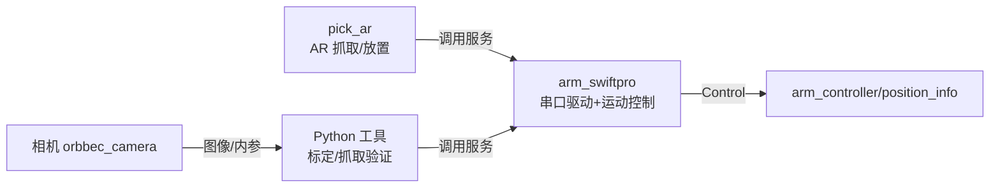

# arm_controller — uArm Swift Pro 机械臂控制说明书

> 适用版本：ROS2 Humble
> 维护：Shenzhen Reinovo Technology Co., Ltd
> 机械臂：uArm Swift Pro（USB 串口 `/dev/ttyACM0`，波特率 115200）

---

## 文件结构

```
src/arm_controller/
├── msg/Control.msg              # 位姿消息
├── srv/{Move,PickPlace,RelativePos,Number}.srv
├── launch/
│   ├── arm_controller.launch.py # 仅启动机械臂驱动（可传 port）
│   └── pick_ar.launch.py        # 机械臂驱动 + AR 抓取
├── src/
│   ├── arm_swiftpro.cpp         # ★ 核心驱动（已编译）
│   └── pick_ar.cpp              # ★ AR 抓取（已编译）
│   ├── arm_ar.cpp               # ⚠ ROS1 遗留（未编译）
│   ├── arm_controller.cpp       # ⚠ ROS1 遗留（未编译）
│   ├── pick_number.cpp          # ⚠ ROS1 遗留（未编译）
│   └── eye_calibration.cpp      # ⚠ ROS1 遗留（未编译）
└── scripts/
    ├── explore_workspace.py     # 工作空间探索
    ├── gen_marker.py            # 生成标定板
    ├── hand_eye_calib.py        # 手眼标定
    └── grab_test.py             # 抓取验证
```

> ⚠ `src/` 下带 `ros/ros.h`、`tf/` 头文件的 4 个文件是 **ROS1 迁移前的遗留代码，未加入 CMakeLists.txt 编译**，当前不可用，可忽略或删除。

---

## 功能详细说明

### 1. 工作空间探索

自动测试网格上的可达性，输出机械臂各轴实际工作范围。

```bash
# 前置：机械臂已启动
ros2 run arm_controller explore_workspace.py
```

流程：通信测试 → 沿 X/Y/Z 各轴逐点试探 → 测试手腕旋转（0~180°）→ 测试 8 个角落位置 → 汇总可达范围。

> ⚠ 运行期间机械臂会连续运动，确保周围无遮挡。

### 2. 手眼标定（Eye-to-Hand）

标定**相机坐标系 → 机械臂基座坐标系**的 4×4 变换矩阵，供后续视觉抓取使用。

**第 1 步：生成标定板**

```bash
ros2 run arm_controller gen_marker.py
```

- 生成 ArUco 图片 `/tmp/aruco_marker_4.png`
- 字典 `DICT_4X4_100`，**ID=4**，打印尺寸务必为 **50mm × 50mm**
- 把打印好的标定板贴在机械臂末端吸盘上

**第 2 步：运行标定**

```bash
# 前置：机械臂 + 相机已启动
ros2 run arm_controller hand_eye_calib.py
```

- 机械臂自动尝试 20 个预设位置，采集 9 个有效点（机械臂坐标 + 相机检测坐标）
- 用 **SVD 初值 + 非线性最小二乘（Levenberg-Marquardt）** 求解变换矩阵
- 结果保存到：
  - `/home/ubuntu/ros2fox/calib_result/hand_eye_result.json`
  - `/tmp/hand_eye_result.json`（副本）

**第 3 步：验证标定**

```bash
# 前置：把标定板从机械臂取下，放在桌面上相机视野内
ros2 run arm_controller grab_test.py
```

- 检测桌面上的 ArUco（ID=4）→ 转换到机器人坐标 → 交互确认后机械臂移动到目标位置

### 3. AR 抓取（`pick_ar`）

`pick_ar` 依赖外部 AR 标记 TF（话题名形如 `/ar_marker_N`，由 ar_track_alvar / aruco 检测节点发布），并通过 TF 查找 `robot → /ar_marker_N` 的变换后调用 `goto_position`/`pick`/`place` 抓取。

服务调用示例：

```bash
# 抓取编号 1 的 AR 标记（mode=1），抓到后放置到 (200, 100, 100)
ros2 service call /pick_ar arm_controller/srv/PickPlace \
  "{number: 1, mode: 1, pose: {position: {x: 200.0, y: 100.0, z: 100.0}, roll: 0.0, pitch: 0.0, yaw: 0.0}}"

# 放置到指定位置
ros2 service call /place_ar arm_controller/srv/Move \
  "{pose: {position: {x: 200.0, y: 100.0, z: 100.0}, roll: 0.0, pitch: 0.0, yaw: 0.0}}"
```

---

## 常用服务调用示例

```bash
# 移动到 (200, 0, 130)
ros2 service call /goto_position arm_controller/srv/Move \
  "{pose: {position: {x: 200.0, y: 0.0, z: 130.0}, roll: 0.0, pitch: 0.0, yaw: 0.0}}"

# 相对移动 (+10, 0, 0)mm
ros2 service call /relative_position arm_controller/srv/RelativePos "{dx: 10.0, dy: 0.0, dz: 0.0}"

# 吸泵开 / 关
ros2 service call /pump std_srvs/srv/SetBool "{data: true}"
ros2 service call /pump std_srvs/srv/SetBool "{data: false}"

# 回安全位 / 解锁电机（手动调整）
ros2 service call /home std_srvs/srv/SetBool "{data: true}"
ros2 service call /unlock std_srvs/srv/SetBool "{data: true}"

# 查看机械臂当前位姿
ros2 topic echo /arm_controller/position_info
```

---

## 话题

### 发布的话题

| 话题 | 类型 | 说明 |
|------|------|------|
| `arm_controller/position_info` | `arm_controller/msg/Control` | 机械臂当前末端位置（10Hz） |

### 服务一览

**由 `arm_swiftpro` 提供（核心）**

| 服务 | 类型 | 功能 |
|------|------|------|
| `/goto_position` | `Move` | 直线移动到目标位姿（带可达性检测与螺旋就近修正） |
| `/pick` | `Move` | 移动到目标位并**开启吸泵**（`M2231 V1`） |
| `/place` | `Move` | 移动到目标位并**关闭吸泵**（`M2231 V0`） |
| `/relative_position` | `RelativePos` | 相对当前位置移动 dx/dy/dz |
| `/pump` | `std_srvs/SetBool` | 吸泵开关（true=吸，false=放） |
| `/home` | `std_srvs/SetBool` | 回到安全位 (200, 0, 150) |
| `/set_zero` | `std_srvs/SetBool` | 把当前位姿设为机械臂零点（`M2401`） |
| `/unlock` | `std_srvs/SetBool` | 解锁电机，可手动扳动机械臂（`M2019`） |

**由 `pick_ar` 提供**

| 服务 | 类型 | 功能 |
|------|------|------|
| `/pick_ar` | `PickPlace` | 按 AR 标记编号抓取（见上方「AR 抓取」） |
| `/place_ar` | `Move` | 把物体放置到指定位置 |

### 坐标范围

| 轴 | 范围 |
|----|------|
| X | 30 ~ 320 |
| Y | -180 ~ 180 |
| Z | 20 ~ 200 |

> 目标超出范围时，`goto_position` 会自动在 XY 平面做**螺旋就近搜索**（半径 0~60mm 步进 10mm）找可达替代点；仍不可达则回安全位 (200, 0, 130)。

---

## 执行程序一览

| 程序 | 类型 | 节点名 | 功能 |
|------|------|--------|------|
| `arm_swiftpro` | C++ | `swiftpro_write_node` | 机械臂串口驱动核心节点（运动/气泵/归位等 8 个服务） |
| `pick_ar` | C++ | `robot_pick` | AR 标记识别抓取/放置 |
| `explore_workspace.py` | Python | `workspace_explorer` | 工作空间探索，输出可达范围 |
| `gen_marker.py` | Python | —（一次性脚本） | 生成 ArUco 标定板图片 |
| `hand_eye_calib.py` | Python | `hand_eye_calibrator` | 手眼标定（相机→机器人基座变换矩阵） |
| `grab_test.py` | Python | `grab_test` | 手眼标定结果验证/抓取测试 |

---

## 简介

本包负责 **uArm Swift Pro 机械臂**的串口驱动、运动控制、气泵抓取，以及基于**视觉（ArUco/AR 标记）**的抓取与**手眼标定**功能。



### 硬件前提
- uArm Swift Pro 通过 USB 连接，串口设备 `/dev/ttyACM0`，波特率 115200
- 气泵吸盘接在机械臂末端（由 `M2231` GCode 控制）
- 视觉功能需要 Orbbec 相机运行（话题 `/camera/color/image_raw`、`/camera/color/camera_info`）
