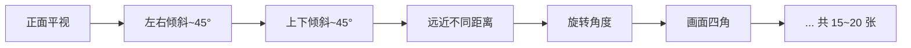

# 📷 Orbbec Astra Pro Plus 相机标定流程

<p align="center">
  
  
  
  
</p>

> **适用场景**：首次使用 Orbbec Astra Pro Plus 相机，需要获取准确的相机内参（焦距、主点、畸变系数）。  
> **耗时**：约 20~30 分钟  
> **所需工具**：棋盘格标定板（5×7 格子，30mm/格）、A4 纸打印或亚克力板

---

## 📋 目录

- [0. 环境准备](#0-环境准备)
- [1. 启动相机](#1-启动相机)
- [2. 采集标定图像](#2-采集标定图像)
- [3. 计算内参](#3-计算内参)
- [4. 生成 YAML 标定文件](#4-生成-yaml-标定文件)
- [5. 验证标定结果](#5-验证标定结果)
- [6. 查看图像](#6-查看图像)
- [常见问题](#-常见问题)
- [文件结构](#-文件结构)

---

## 0. 环境准备

```bash
# 打开终端，进入工作空间
cd ~/havest_robot

# 加载 ROS2 环境
source /opt/ros/humble/setup.bash
source install/setup.bash
```

---

## 1. 启动相机

打开 **终端 1**，启动相机节点：

```bash
cd ~/havest_robot
source /opt/ros/humble/setup.bash
source install/setup.bash

# 首次标定（无标定文件）：
ros2 launch orbbec_camera astra_pro_plus.launch.py

# 已有标定文件（替换为实际路径）：
ros2 launch orbbec_camera astra_pro_plus.launch.py \
  color_info_url:="file://$(pwd)/calib_data/color/color_camera_info.yaml" \
  ir_info_url:="file://$(pwd)/calib_data/ir/ir_camera_info.yaml"
```

> [!TIP]
> 首次标定时先不加 `color_info_url` 和 `ir_info_url`，等标定完成后再加上。

---

## 2. 采集标定图像

打开 **终端 2**，依次采集彩色和红外图像：

```bash
cd ~/havest_robot
source /opt/ros/humble/setup.bash
source install/setup.bash

# 采集彩色相机图像
python3 src/calibration/calibrate_camera.py capture \
  --topic color --dir ./calib_data/color --size 4x6

# 采集红外相机图像
python3 src/calibration/calibrate_camera.py capture \
  --topic ir --dir ./calib_data/ir --size 4x6
```

### 🎮 按键操作

| 按键 | 功能 |
|------|------|
| <kbd>空格</kbd> | 保存当前图像（需检测到棋盘格） |
| <kbd>ESC</kbd> | 退出采集 |
| <kbd>R</kbd> | 重置已采集计数 |

### 💡 采集技巧

将棋盘格在相机前缓慢移动，覆盖以下角度：



- ✅ 画面出现**绿色角点连线**时按空格保存
- ❌ 没有绿色角点 → 调整角度、距离或光照
- 📐 远近都要拍（0.3m ~ 1.5m）
- 🖼️ 棋盘格尽量靠近画面边缘（边缘畸变信息）

> [!IMPORTANT]
> 建议采集 **15~20 张**，覆盖越全面，标定结果越准确。

---

## 3. 计算内参

```bash
# 计算彩色相机内参
python3 src/calibration/calibrate_camera.py calibrate \
  --dir ./calib_data/color --size 4x6 --square 30

# 计算红外相机内参
python3 src/calibration/calibrate_camera.py calibrate \
  --dir ./calib_data/ir --size 4x6 --square 30
```

### 📊 结果解读

| 指标 | 优秀 | 可接受 | 需重采 |
|------|------|--------|--------|
| 🔄 重投影误差 | < 0.3 px | < 1.0 px | > 1.0 px |
| 📏 fx, fy | ~590~600 | — | 偏差过大 |
| 🎯 cx, cy | 接近图像中心 (320, 240) | — | 偏差过大 |

**示例输出**（实际标定结果）：
```
标定结果 (重投影误差: 0.184673)

相机矩阵 K:
  fx = 599.6333    fy = 595.4111
  cx = 320.8181    cy = 244.4311

图像尺寸: 640x480
```

> [!WARNING]
> 如果重投影误差 > 1.0 px，返回步骤 2 补充更多不同角度的图像（特别是画面边缘区域）。

---

## 4. 生成 YAML 标定文件

标定完成后会自动生成 `camera_info.yaml`，也可手动运行：

```bash
python3 src/calibration/gen_yaml.py
```

生成的文件位于：
- `calib_data/color/color_camera_info.yaml` — 彩色相机
- `calib_data/ir/ir_camera_info.yaml` — 红外相机

---

## 5. 验证标定结果

```bash
# 终端 1 — 重启相机（带上标定文件）
ros2 launch orbbec_camera astra_pro_plus.launch.py \
  color_info_url:="file://$(pwd)/calib_data/color/color_camera_info.yaml" \
  ir_info_url:="file://$(pwd)/calib_data/ir/ir_camera_info.yaml"

# 终端 2 — 查看内参
ros2 topic echo /camera/color/camera_info --once
```

**验证标准** ✅：

```yaml
k:
- 599.6333   ← fx ≠ NaN ✅
- 0.0
- 320.8181   ← cx ≠ NaN ✅
- 0.0
- 595.4111   ← fy ≠ NaN ✅
- 244.4311   ← cy ≠ NaN ✅
- 0.0
- 0.0
- 1.0
```

---

## 6. 查看图像

```bash
python3 src/depth_viewer.py
```

| 按键 | 功能 |
|------|------|
| <kbd>1</kbd> | 深度图 + 红外图 |
| <kbd>2</kbd> | 深度图 + RGB 图 |
| <kbd>3</kbd> | 三图同屏显示 |
| <kbd>S</kbd> | 截图保存 |
| <kbd>ESC</kbd> / <kbd>Q</kbd> | 退出 |

鼠标悬停在图像上可查看对应像素值。

---

## ❓ 常见问题

<details>
<summary><strong>Q: 按空格无法保存？</strong></summary>

检查画面是否出现**绿色角点连线**。如果没有：
- 调整棋盘格与相机的**角度**
- 调整**距离**（0.3~1m 最佳）
- 改善**光照**（避免过暗或反光）
- 使用诊断工具：`python3 src/calibration/detect_checkerboard.py`
</details>

<details>
<summary><strong>Q: 采集时图像太暗/太亮？</strong></summary>

调整环境光照，避免强光直射或阴影遮挡棋盘格。
</details>

<details>
<summary><strong>Q: 内参还是 NaN？</strong></summary>

- 确保启动相机时传入了正确的 `color_info_url` 参数
- 检查 YAML 文件格式是否正确（不可含 `!!python/object` 等标记）
- YAML 文件路径需使用**绝对路径**或 `file://` 协议
</details>

<details>
<summary><strong>Q: 标定质量差（重投影误差 > 1.0px）</strong></summary>

重新采集 20~30 张图像，特别注意：
- 棋盘格放在画面**边缘和角落**
- **远近**不同距离各拍几张
- 各方向**倾斜**角度
</details>

<details>
<summary><strong>Q: 红外和彩色需要分别标定吗？</strong></summary>

需要。两个相机的光学参数不同，必须分别采集和标定。
</details>

---

## 📁 文件结构

```
havest_robot/
├── src/
│   ├── depth_viewer.py                    # 图像查看工具
│   └── calibration/
│       ├── 相机内参标定.md                 # 📄 本文档
│       ├── calibrate_camera.py            # 🔧 标定主工具
│       ├── detect_checkerboard.py         # 🔍 棋盘格检测诊断
│       ├── gen_yaml.py                    # 📝 生成 camera_info YAML
│       └── inject_calibration.py          # 💉 运行时注入标定
└── calib_data/
    ├── color/                             # 🎨 彩色相机标定数据
    │   ├── image_0000.png ...
    │   ├── calibration_result.npz
    │   └── color_camera_info.yaml
    └── ir/                                # 🌑 红外相机标定数据
        ├── image_0000.png ...
        ├── calibration_result.npz
        └── ir_camera_info.yaml
```

---

<p align="center">
  <b>Happy Calibrating!</b> 🎯
</p>
