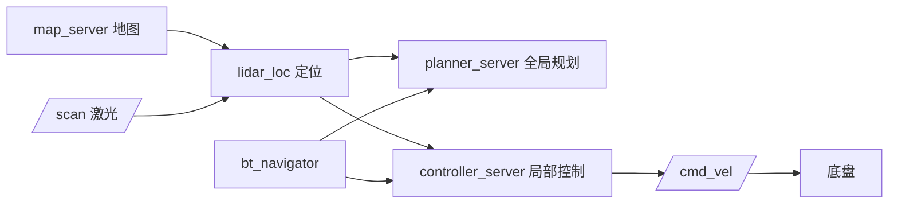

# fox_navigation_ros2 — 导航说明书

> 适用版本：ROS2 Humble
> 维护：Shenzhen Reinovo Technology Co., Ltd
> 功能：基于 **Nav2** 的自主导航（地图加载 + lidar_loc 激光匹配定位 + 全局/局部规划 + 路径跟踪）

---

## 文件结构

```
src/fox_navigation_ros2/
├── launch/
│   ├── fox_navigation.launch.py   # ★ 导航主 launch（一键启动）
│   └── map_server.launch.py       # 单独加载地图（map_server + lifecycle）
├── param/
│   ├── nav2_params.yaml           # Nav2 综合参数（planner/controller/costmap/lidar_loc 定位参数/bt/map_server）
│   └── amcl_diff_params.yaml      # AMCL 差速底盘定位参数（已弃用，回退备用）
├── src/
│   └── lidar_loc.cpp              # ★ 激光“势场爬山匹配”定位节点（替代 amcl，jie_ware 算法移植）
├── rviz/nav.rviz                  # 导航 RViz 配置
├── package.xml  CMakeLists.txt
```

---

## 功能详细说明

### 1. 导航栈结构（Nav2）

`fox_navigation.launch.py` 一键启动全部组件：

| 节点 | 功能 |
|------|------|
| `robot_state_publisher` | 机器人模型 TF |
| `rei_base`（底盘） | `/cmd_vel` → 电机运动 |
| `ydlidar_ros2_driver_node` | 激光 `/scan`（障碍感知） |
| `map_server` | 加载栅格地图 |
| `lidar_loc` | 激光“势场爬山匹配”定位（发布 map→odom，替代 AMCL） |
| `planner_server` | 全局路径规划 |
| `controller_server` | 局部路径规划 + 速度控制 |
| `bt_navigator` | 行为树导航决策 |
| `recoveries_server` | 异常恢复 |
| `lifecycle_manager_navigation` | 自动管理各节点生命周期 |
| `rviz2` | 可视化 |

### 2. 规划与控制器

- **全局规划**：`NavfnPlanner`（`GridBased`），生成全局路径
- **局部规划/控制**：`DWAPlannerController`（DWA 动态窗口法），限速 `max_vel_x=0.4`、`max_vel_y=0.2`、`max_vel_theta=0.8`，到位容差 `xy=0.05m / yaw=0.17rad`

### 3. 代价地图（Costmap）

- **全局 costmap**：frame=`map`，静态层（地图）+ 障碍层（VoxelLayer，来自 `/scan`）+ 膨胀层（半径 0.55m）
- **局部 costmap**：frame=`odom`，滚动窗口（2m），同样含障碍 + 膨胀

### 4. lidar_loc 定位（替代 AMCL）

- 算法：移植自 `jie_ware`（ROS1，6-robot）的 `lidar_loc`——“把地图裁切成图像、障碍扩散成距离势场、每帧雷达点云在当前位姿邻域（±1 格 / ±1°）爬山求匹配分最高点”，**不依赖里程计预测**，场地打滑时比 AMCL 更稳。源码 `src/lidar_loc.cpp`
- 输出：`map→odom` TF（30Hz）与 `/lidar_loc_pose`；订阅 `/map`、`/scan`、`/initialpose`（RViz 2D Pose Estimate）
- ⚠️ 与 AMCL 相同：上电后需在 RViz 用 **2D Pose Estimate** 给一次初始位姿；空旷无墙区无匹配梯度，定位会“冻结”，需贴近墙/障碍行走才有效
- 回退 AMCL：把 `fox_navigation.launch.py` 中 `lidar_loc` 节点换回 `nav2_amcl` 的 `amcl` 节点并加回 `lifecycle_manager` 的 `node_names` 即可（`nav2_params.yaml` 的 `amcl:` 段已保留）

### 5. 地图加载

- 主 launch 中 `map_server` 使用 `nav2_params.yaml` 的 `yaml_filename: "map.yaml"`（相对路径，**需要在含 map.yaml 的目录下运行**或修改该参数）
- 也可用独立 launch 加载指定目录的地图：

```bash
ros2 launch fox_navigation_ros2 map_server.launch.py \
  map_file:=test_map.yaml \
  map_directory:=/home/ubuntu/ros2fox/maps
```

---

## 常用命令

```bash
export REI_ROBOT=fox_three

# ── 启动导航 ──
# 注意：默认地图为当前目录的 map.yaml，请先确保存在（或改 nav2_params.yaml）
ros2 launch fox_navigation_ros2 fox_navigation.launch.py

# ── 在 RViz 中操作 ──
# 1. 用 "2D Pose Estimate" 设置机器人初始位姿
# 2. 用 "2D Goal Pose" 发布导航目标点

# ── 命令行发布导航目标 ──
ros2 action send_goal /navigate_to_pose nav2_msgs/action/NavigateToPose \
  "{pose: {header: {frame_id: 'map'}, pose: {position: {x: 1.0, y: 0.0, z: 0.0}, orientation: {w: 1.0}}}}"

# ── 单独加载地图（可选） ──
ros2 launch fox_navigation_ros2 map_server.launch.py \
  map_file:=test_map.yaml \
  map_directory:=/home/ubuntu/ros2fox/maps
```

---

## 话题

### 订阅的话题

| 话题 | 类型 | 说明 |
|------|------|------|
| `/scan` | `sensor_msgs/LaserScan` | 激光障碍感知（costmap/lidar_loc 输入） |
| `/map` | `nav_msgs/OccupancyGrid` | 静态地图（map_server 发布，lidar_loc/costmap 使用） |
| `/navigate_to_pose`（Action） | `nav2_msgs/action/NavigateToPose` | 导航目标指令 |

### 发布的话题

| 话题 | 类型 | 说明 |
|------|------|------|
| `/cmd_vel` | `geometry_msgs/Twist` | 底盘速度指令 |
| `/lidar_loc_pose` | `geometry_msgs/PoseWithCovarianceStamped` | lidar_loc 定位结果（map 系，诊断用） |
| `/plan` | `nav_msgs/Path` | 全局/局部路径（可视化） |
| `/global_costmap/costmap` 等 | `nav_msgs/OccupancyGrid` | 代价地图（可视化） |
| `/map` | `nav_msgs/OccupancyGrid` | 加载的地图 |

### 坐标系（TF 树）

```
map ──(lidar_loc)──> odom ──(底盘驱动)──> base_footprint ──(robot_state_publisher)──> front_lidar_link
```

> 导航依赖建图保存的地图（`fox_slam_ros2` 生成），以及良好的里程计。

---

## 执行程序一览

| 程序/launch | 类型 | 功能 |
|------|------|------|
| `fox_navigation.launch.py` | launch | 导航主 launch（机器人/底盘/雷达/地图/定位/规划/控制/RViz 一键启动） |
| `map_server.launch.py` | launch | 单独加载指定地图（map_server + lifecycle） |

---

## 简介

本包基于 Nav2 实现 FOX 机器人的**自主导航**：加载建图阶段保存的地图，通过 lidar_loc（jie_ware 算法）实时定位，结合全局（Navfn）与局部（DWA）规划器生成并跟踪路径，输出 `/cmd_vel` 驱动底盘到达目标点。


