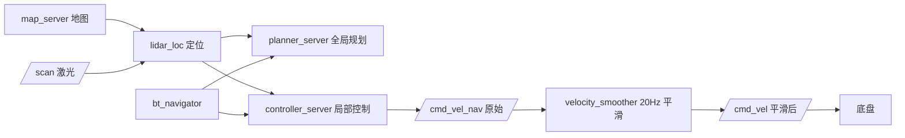

# fox_navigation_ros2 — 导航说明书

> 适用版本：ROS2 Humble
> 维护：Shenzhen Reinovo Technology Co., Ltd
> 功能：基于 **Nav2** 的自主导航（地图加载 + lidar_loc 激光匹配定位 + 全局/局部规划 + 路径跟踪）

---

## 文件结构

```
src/fox_navigation_ros2/
├── launch/
│   ├── fox_navigation.launch.py   # ★ 导航主 launch（一键启动）
│   └── map_server.launch.py       # 单独加载地图（map_server + lifecycle）
├── param/
│   ├── nav2_params.yaml           # Nav2 综合参数（planner/controller/costmap/lidar_loc 定位参数/bt/map_server）
│   └── amcl_diff_params.yaml      # AMCL 差速底盘定位参数（已弃用，回退备用）
├── src/
│   └── lidar_loc.cpp              # ★ 激光“势场爬山匹配”定位节点（替代 amcl，jie_ware 算法移植）
├── rviz/nav.rviz                  # 导航 RViz 配置
├── package.xml  CMakeLists.txt
```

---

## 功能详细说明

### 1. 导航栈结构（Nav2）

`fox_navigation.launch.py` 一键启动全部组件：

| 节点 | 功能 |
|------|------|
| `robot_state_publisher` | 机器人模型 TF |
| `rei_base`（底盘） | `/cmd_vel` → 电机运动 |
| `ydlidar_ros2_driver_node` | 激光 `/scan`（障碍感知） |
| `map_server` | 加载栅格地图 |
| `lidar_loc` | 激光“势场爬山匹配”定位（发布 map→odom，替代 AMCL） |
| `planner_server` | 全局路径规划 |
| `controller_server` | 局部路径规划 + 速度控制 |
| `bt_navigator` | 行为树导航决策 |
| `recoveries_server` | 异常恢复 |
| `lifecycle_manager_navigation` | 自动管理各节点生命周期 |
| `rviz2` | 可视化 |

### 2. 规划与控制器

- **全局规划**：`NavfnPlanner`（`GridBased`），生成全局路径
- **局部规划/控制**：`DWAPlannerController`（DWA 动态窗口法），限速 `max_vel_x=0.4`、`max_vel_y=0.2`、`max_vel_theta=0.8`，到位容差 `xy=0.05m / yaw=0.17rad`

### 3. 代价地图（Costmap）

- **全局 costmap**：frame=`map`，静态层（地图）+ 障碍层（VoxelLayer，来自 `/scan`）+ 膨胀层（半径 0.55m）
- **局部 costmap**：frame=`odom`，滚动窗口（2m），同样含障碍 + 膨胀

### 4. lidar_loc 定位（替代 AMCL）

- 算法：移植自 `jie_ware`（ROS1，6-robot）的 `lidar_loc`——“把地图裁切成图像、障碍扩散成距离势场、每帧雷达点云在当前位姿邻域（±1 格 / ±1°）爬山求匹配分最高点”，**不依赖里程计预测**，场地打滑时比 AMCL 更稳。源码 `src/lidar_loc.cpp`
- 输出：`map→odom` TF（30Hz）与 `/lidar_loc_pose`；订阅 `/map`、`/scan`、`/initialpose`（RViz 2D Pose Estimate）
- ⚠️ 与 AMCL 相同：上电后需在 RViz 用 **2D Pose Estimate** 给一次初始位姿；空旷无墙区无匹配梯度，定位会“冻结”，需贴近墙/障碍行走才有效
- 回退 AMCL：把 `fox_navigation.launch.py` 中 `lidar_loc` 节点换回 `nav2_amcl` 的 `amcl` 节点并加回 `lifecycle_manager` 的 `node_names` 即可（`nav2_params.yaml` 的 `amcl:` 段已保留）

### 5. 地图加载

- 主 launch 中 `map_server` 使用 `nav2_params.yaml` 的 `yaml_filename: "map.yaml"`（相对路径，**需要在含 map.yaml 的目录下运行**或修改该参数）
- 也可用独立 launch 加载指定目录的地图：

```bash
ros2 launch fox_navigation_ros2 map_server.launch.py \
  map_file:=test_map.yaml \
  map_directory:=/home/ubuntu/ros2fox/maps
```

---

## 常用命令

```bash
export REI_ROBOT=fox_three

# ── 启动导航 ──
# 注意：默认地图为当前目录的 map.yaml，请先确保存在（或改 nav2_params.yaml）
ros2 launch fox_navigation_ros2 fox_navigation.launch.py

# ── 在 RViz 中操作 ──
# 1. 用 "2D Pose Estimate" 设置机器人初始位姿
# 2. 用 "2D Goal Pose" 发布导航目标点

# ── 命令行发布导航目标 ──
ros2 action send_goal /navigate_to_pose nav2_msgs/action/NavigateToPose \
  "{pose: {header: {frame_id: 'map'}, pose: {position: {x: 1.0, y: 0.0, z: 0.0}, orientation: {w: 1.0}}}}"

# ── 单独加载地图（可选） ──
ros2 launch fox_navigation_ros2 map_server.launch.py \
  map_file:=test_map.yaml \
  map_directory:=/home/ubuntu/ros2fox/maps
```

---

## 话题

### 订阅的话题

| 话题 | 类型 | 说明 |
|------|------|------|
| `/scan` | `sensor_msgs/LaserScan` | 激光障碍感知（costmap/lidar_loc 输入） |
| `/map` | `nav_msgs/OccupancyGrid` | 静态地图（map_server 发布，lidar_loc/costmap 使用） |
| `/navigate_to_pose`（Action） | `nav2_msgs/action/NavigateToPose` | 导航目标指令 |

### 发布的话题

| 话题 | 类型 | 说明 |
|------|------|------|
| `/cmd_vel_nav` | `geometry_msgs/Twist` | 控制器/行为服务器输出的**原始（未平滑）**速度指令（2026-09-22 新增） |
| `/cmd_vel` | `geometry_msgs/Twist` | 经 `velocity_smoother` 平滑后**底盘真正收到**的速度指令（也是网页/键盘遥控直接发布的话题） |
| `/lidar_loc_pose` | `geometry_msgs/PoseWithCovarianceStamped` | lidar_loc 定位结果（map 系，诊断用） |
| `/plan` | `nav_msgs/Path` | 全局/局部路径（可视化） |
| `/global_costmap/costmap` 等 | `nav_msgs/OccupancyGrid` | 代价地图（可视化） |
| `/map` | `nav_msgs/OccupancyGrid` | 加载的地图 |

### 坐标系（TF 树）

```
map ──(lidar_loc)──> odom ──(底盘驱动)──> base_footprint ──(robot_state_publisher)──> front_lidar_link
```

> 导航依赖建图保存的地图（`fox_slam_ros2` 生成），以及良好的里程计。

---

## 执行程序一览

| 程序/launch | 类型 | 功能 |
|------|------|------|
| `fox_navigation.launch.py` | launch | 导航主 launch（机器人/底盘/雷达/地图/定位/规划/控制/RViz 一键启动） |
| `map_server.launch.py` | launch | 单独加载指定地图（map_server + lifecycle） |

---

## 简介

本包基于 Nav2 实现 FOX 机器人的**自主导航**：加载建图阶段保存的地图，通过 lidar_loc（jie_ware 算法）实时定位，结合全局（Navfn）与局部（DWA）规划器生成并跟踪路径，输出 `/cmd_vel` 驱动底盘到达目标点。



---

## 2026-09-22 运动品质优化（阶段 A）

治「①移动卡顿不丝滑 ②到点附近一直微调停不下来 ③目标在正后方局部规划失效」。
改动全部集中在 `param/nav2_params.yaml` + `launch/fox_navigation.launch.py`（src/install 已同步）。

### 新增：`velocity_smoother`（治 ①）

- 原因：DWB 每 100ms 从**离散**采样格里挑一条轨迹，`/cmd_vel` 上是台阶状速度跳变，底盘直接吃阶跃 → 一顿一顿。
- 做法：`controller_server` / `behavior_server` 的 `cmd_vel` remap 到 `/cmd_vel_nav`；`velocity_smoother` 以 20Hz 按加速度限制插值，输出到 `/cmd_vel`。
- ⚠️ `feedback: OPEN_LOOP`：场地打滑，用 odom 反馈会把「轮子空转」的假速度当成真实速度。
- ⚠️ `min_velocity[0]` 必须 ≤ `min_vel_x`（-0.12），否则倒车指令在这里被夹成 0。
- ⚠️ 平滑器空闲时**不发消息**（超 `velocity_timeout` 且已停稳后静默），所以网页/键盘遥控直接发 `/cmd_vel` 不受影响。
- ⚠️ 它是 lifecycle 节点，已加入 launch 的 `lifecycle_manager` 的 `node_names`；漏了会导致「机器人完全不动」。

### 修正：到位判据原来根本没生效（治 ②）

`controller_server` 段**整个缺失** `progress_checker_plugin` / `goal_checker_plugins` → 实际生效的是 Nav2 的 C++ 默认值：

| 参数 | 原以为 | 实际生效 | 现在 |
|------|--------|----------|------|
| `xy_goal_tolerance` | 0.02（写在 `FollowPath` 下） | **0.25 m**（SimpleGoalChecker 默认） | 0.05（goal_checker 段） |
| `yaw_goal_tolerance` | 0.05 | **0.25 rad** | 0.10（goal_checker 段） |
| `latch_xy_goal_tolerance` | true | 无此参数，**静默忽略** | `stateful: true` |
| `required_movement_radius` | — | **0.5 m / 10 s** | 0.10 m / 20 s |

`FollowPath` 下的 `xy_goal_tolerance` 只有 DWB 的 `RotateToGoalCritic` 会读（决定何时切「最终对角度」），两者必须一致；`yaw_goal_tolerance` / `latch_xy_goal_tolerance` 在 dwb 库里**不存在**（`grep /opt/ros/humble/lib` 只有 `libdwb_critics.so`、`libsimple_goal_checker.so` 声明 `xy_goal_tolerance`）。

### 修正：这些参数名在 Humble 里不存在（静默失效）

| 原来写的（无效） | 真实名字 | 后果 |
|------|------|------|
| `plugins: ["FollowPath"]` | `controller_plugins` | 靠默认 id/type 恰好相同才碰巧能跑（`planner_server` 同理：`plugins`→`planner_plugins`，本包仍是旧写法，未改） |
| `vth_samples: 12` | `vtheta_samples` | **降负载一直没生效**，实际是默认 20 → 每周期 10×4×20=800 条轨迹，Jetson 掉帧 → 抖 |
| `min_in_place_vel_theta: 0.0` | 不存在（ROS1 DWA 遗留） | 原地掉头慢要调 `acc_lim_theta` |
| `publish_traj_pc: false` | `publish_trajectories` | 默认 **true**，一直在发候选轨迹点云/评估消息，白烧 CPU |

### 其他调整

- `min_vel_x: 0.0 → -0.12`（治 ③）：`RotateToGoalCritic` 只在进入 `xy_goal_tolerance` 后才生效，中途的「原地掉头」轨迹压不过 `PathAlign`/`PathDist`（各 64），所以正后方目标在「没有倒车轨迹」时只能卡住。三轮全向倒车无需掉头。
- `sim_time: 2.0 → 1.5`、`vtheta_samples: 8`、`short_circuit_trajectory_evaluation: true`、`publish_evaluation: false` → 降 CPU，减少掉帧。
- `xy_goal_tolerance: 0.02 → 0.05`：2cm 在打滑+定位抖动下几乎进不去，`RotateToGoal` 永不触发 → 终点反复小修。

### 回退指引

- 又出现「进退抖」→ `min_vel_x` 回 `0.0`，并改用行为树 `Spin` 掉头。
- 刹车/绕障变差 → `sim_time` 回 `1.8`。
- 需要看候选轨迹/评估 → `publish_trajectories` / `publish_evaluation` 回 `true`。
- RViz 里要看「控制器原始意图 vs 平滑后」→ 加 `/cmd_vel_nav`（原始）与 `/cmd_vel`（平滑后）两个 Twist 显示。

---

## 2026-09-28 「给近点就失败、进恢复模式」修复

### 现象与真根因

给一个**距离较近**的导航点，控制器报错、行为树进恢复模式（清代价地图 → Spin → Wait → BackUp），折腾几轮后才能到点。

**不是局部规划器（DWB）算不出轨迹**——日志实证（`~/.ros/log/controller_server_*.log`）：

| 检查项 | 结果 |
|---|---|
| 失败原文 | `[ERROR] [controller_server]: Failed to make progress` + `[follow_path] [ActionServer] Aborting handle` |
| 该字符串所在库 | 只在 `libcontroller_server_core.so`（**不在任何 dwb 库**） |
| 有无 `No valid trajectories` / `IllegalTrajectory` | 没有 |
| planner_server | 全程无错（全局规划正常，1 Hz 持续下发新路径） |
| 统计（09-24 一次运行） | bt_navigator **39 次成功 / 0 次失败**，但 controller 有 **24 次** `Failed to make progress` |
| 失败间隔 | 常**正好 20.0 s** = `movement_time_allowance` |

### 机制（Humble `simple_progress_checker.cpp` 实证）

```cpp
bool SimpleProgressChecker::check(const PoseStamped & p) {
  if ((!baseline_pose_set_) || (isRobotMovedEnough(p.pose))) {
    resetBaselinePose(p.pose);   // 只有"走了够远"才重置基准位姿+基准时间
    return true;
  }
  return !((clock_->now() - baseline_time_) > time_allowance_);   // 超时 → abort
}
bool SimpleProgressChecker::isRobotMovedEnough(const Pose & p) {
  return pose_distance(p, baseline_pose_) > radius_;   // ← 只算平移，旋转不算
}
```

→ **当剩余路程 < `required_movement_radius`，或只剩"原地对角度"时，计时器永不重置**，整个收尾必须在 `movement_time_allowance` 内完成，否则必然 abort。**目标越近越必然踩中。**

> ⚠️ 这也是 09-22 收紧 `goal_checker`（xy 0.25 → 0.05）的副作用：以前 25 cm 就算到点（等于提前结束），近点根本来不及触发进展检查。

### 本轮改动（`controller_server` 段）

| 参数 | 改前 | 改后 | 原因 |
|---|---|---|---|
| `progress_checker.plugin` | `SimpleProgressChecker` | **`PoseProgressChecker`** | 后者把「转动 > `required_movement_angle`」也算进展 → 终点原地对角度时计时器不断重置；真卡死（一动不动）仍会在 20 s 后报错，检测能力保留 |
| `progress_checker.required_movement_radius` | 0.10 | **0.05** | 近点剩余路程可能不足 10 cm，半径太大等于永不重置 |
| `progress_checker.required_movement_angle` | — | **0.3**（≈17°） | 仅 `PoseProgressChecker` 有的参数 |
| `failure_tolerance` | 未设（Humble 默认 **0.0**） | **0.3** | 默认值下任一周期失败就立刻 abort FollowPath；上游 nav2_params 默认就是 0.3 |
| `current_goal_checker` | 未设（启动告警） | **`"goal_checker"`** | 只有一个 goal_checker 时虽会自动选中，显式写更明确并消掉告警 |

> `PoseProgressChecker` 已确认在 `/opt/ros/humble/share/nav2_controller/plugins.xml` 注册（"distance **and** angle"），`libpose_progress_checker.so` 存在。

### 验证要点

1. 启动后确认插件真加载：`ros2 param get /controller_server progress_checker.plugin` → `nav2_controller::PoseProgressChecker`
2. 旧症状是否消失：`grep -c "Failed to make progress" ~/.ros/log/controller_server_*.log`（新一次运行应为 0）
3. 若**仍**反复失败，用 `diag_cmd_vel.py` 区分剩下三种可能：
   - 一直原地小转 → 目标贴墙/在膨胀区内，DWB 可平移轨迹被压掉
   - `vx` 正负交替 → `min_vel_x: -0.12` 放大，回 `0.0`
   - `vx` 有值但 `ODOM` 不动 → 打滑/被压住（底盘层，需回阶段 B）


