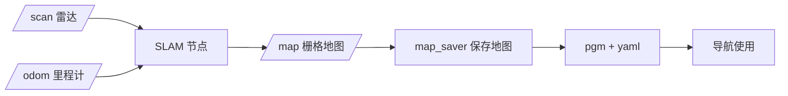

# fox_slam_ros2 — 建图（SLAM）说明书

> 适用版本：ROS2 Humble
> 维护：Shenzhen Reinovo Technology Co., Ltd
> 功能：基于 2D 激光雷达的建图（SLAM），内置 **SLAM Toolbox** 与 **Cartographer** 两套方案，并提供地图保存与里程计标定工具

---

## 文件结构

```
src/fox_slam_ros2/
├── config/
│   ├── fox_slam_params.yaml      # SLAM Toolbox 参数
│   ├── cartographer_fox.lua      # Cartographer 参数（★ 当前默认）
│   └── fox_lidar_params.yaml     # ydlidar 雷达参数（frame=front_lidar_link）
├── launch/
│   ├── fox_slam.launch.py        # SLAM Toolbox 建图（备用）
│   ├── cartographer.launch.py    # ★ Cartographer 建图（默认）
│   ├── fox_lidar.launch.py       # 仅启动雷达
│   └── map_saver.launch.py       # 保存地图（/map → pgm/yaml）
├── rviz/slam.rviz                # 建图 RViz 配置
├── scripts/calibrate_odom.py     # 里程计运动模型标定
├── package.xml  CMakeLists.txt
└── CARTOGRAPHER_SWITCH.md        # SLAM Toolbox→Cartographer 切换记录
```

---

## 功能详细说明

### 1. 两套 SLAM 方案

| 方案 | launch | 配置 | 类型 | 状态 |
|------|--------|------|------|------|
| **Cartographer** | `cartographer.launch.py` | `config/cartographer_fox.lua` | 图优化（子图 + 回环检测） | **当前默认** |
| SLAM Toolbox | `fox_slam.launch.py` | `config/fox_slam_params.yaml` | 图优化（Karto，带回环） | 备用 |

两套方案均内嵌启动：**机器人模型（`robot_state_publisher`）+ 底盘（`base.launch.py`）+ 雷达（ydlidar）+ RViz**，一键建图。

> 切换算法的方法见 `CARTOGRAPHER_SWITCH.md`。

### 2. Cartographer 建图（默认）

- 核心节点 `cartographer_node` + `cartographer_occupancy_grid_node`（发布 `/map`）
- 输入：`/scan` 激光 + `/odom` 里程计（remap `odometry→/odom`），无 IMU
- 子图分辨率 0.05m，实时扫描匹配 + 回环检测 + 位姿图全局优化
- TF：`map → odom`（由 Cartographer 发布），`odom → base_footprint`（底盘驱动），`base_footprint → front_lidar_link`（robot_state_publisher）

### 3. SLAM Toolbox 建图（备用）

- 核心节点 `async_slam_toolbox_node`（异步模式）
- `mode: mapping`、`do_loop_closing: true`（回环检测）
- 也发布 `/map` 供保存

### 4. 保存地图

`map_saver.launch.py` 使用 `nav2_map_server` 的 `map_saver_cli` 订阅 `/map`，保存为 PGM + YAML，供导航加载。

### 5. 里程计标定（`calibrate_odom.py`）

基于 `/odom` 数据计算里程计与实际运动的误差，输出运动模型噪声参数建议值。

```bash
# 平移标定：把机器人遥控直线走 2 米，Ctrl+C 结束
ros2 run fox_slam_ros2 calibrate_odom.py --mode linear --dist 2.0

# 旋转标定：把机器人遥控原地转 360°，Ctrl+C 结束
ros2 run fox_slam_ros2 calibrate_odom.py --mode angular --angle 360.0
```

输出：目标值 vs 里程计报告值、误差比例，以及建议的 `srr/srt`（平移）或 `stt/str`（旋转）噪声系数。

---

## 常用命令

```bash
export REI_ROBOT=fox_three   # 选择底盘型号（fox_three / fox_diff / fox_mecanum）

# ── 建图（Cartographer，推荐） ──
ros2 launch fox_slam_ros2 cartographer.launch.py

# ── 建图（SLAM Toolbox，备用） ──
ros2 launch fox_slam_ros2 fox_slam.launch.py

# 遥控机器人走遍环境
ros2 run teleop_twist_keyboard teleop_twist_keyboard

# ── 保存地图 ──
ros2 launch fox_slam_ros2 map_saver.launch.py \
  map_file:=test_map \
  map_directory:=/home/ubuntu/ros2fox/maps

# ── 仅启动雷达 ──
ros2 launch fox_slam_ros2 fox_lidar.launch.py

# ── 里程计标定 ──
ros2 run fox_slam_ros2 calibrate_odom.py --mode linear --dist 2.0
ros2 run fox_slam_ros2 calibrate_odom.py --mode angular --angle 360.0
```

> 保存的地图默认生成 `<map_directory>/<map_file>.pgm` 和 `.yaml`，供 `fox_navigation_ros2` 导航使用。

---

## 话题

### 发布的话题

| 话题 | 类型 | 说明 |
|------|------|------|
| `/map` | `nav_msgs/OccupancyGrid` | 占用栅格地图（Cartographer 由 occupancy_grid_node 发布；SLAM Toolbox 自带） |
| `/map_metadata` | `nav_msgs/MapMetaData` | 地图元数据 |
| `/slam_toolbox/scan_matcher_pose` 等 | — | SLAM Toolbox 调试话题（备用方案） |

### 订阅的话题

| 话题 | 类型 | 说明 |
|------|------|------|
| `/scan` | `sensor_msgs/LaserScan` | 2D 激光扫描（输入） |
| `/odom` | `nav_msgs/Odometry` | 里程计（输入，Cartographer 方案） |

### 坐标系（TF 树）

```
map ──(SLAM 发布)──> odom ──(底盘驱动)──> base_footprint ──(robot_state_publisher)──> front_lidar_link
```

---

## 执行程序一览

| 程序/launch | 类型 | 功能 |
|------|------|------|
| `cartographer.launch.py` | launch | Cartographer 建图（默认） |
| `fox_slam.launch.py` | launch | SLAM Toolbox 建图（备用） |
| `fox_lidar.launch.py` | launch | 仅启动 ydlidar 雷达 |
| `map_saver.launch.py` | launch | 保存 /map 为 PGM/YAML |
| `calibrate_odom.py` | Python 脚本 | 里程计运动模型标定 |

---

## 简介

本包负责 FOX 机器人的**建图**：以 2D 激光 + 底盘里程计为输入，通过 Cartographer（默认）或 SLAM Toolbox 实时构建占用栅格地图并发布 `/map`，支持一键保存地图供后续导航使用；同时提供里程计标定工具。


