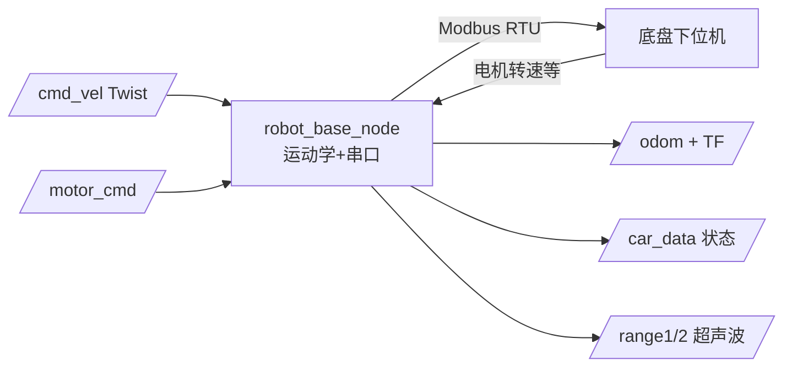

# rei_robot_base — 移动机器人底盘控制说明书

> 适用版本：ROS2 Humble
> 维护：Shenzhen Reinovo Technology Co., Ltd
> 功能：Reinovo 系列底盘（FOX / Bobac / Oryxbot）的串口（Modbus RTU）驱动、运动学解算、里程计与 IO 控制

---

## 文件结构

```
src/rei_robot_base/
├── msg/
│   ├── CarData.msg          # 底盘状态数据（电机转速/电压/IO/温湿度等）
│   ├── MotorCmd.msg         # 电机期望转速指令
│   └── BumperCliff.msg      # 碰撞/跌落标志（bobac2）
├── srv/
│   ├── SetIO.srv            # IO 控制
│   ├── Int8.srv             # 附加电机控制
│   └── CtrlMode.srv         # 控制模式（已定义，暂未使用）
├── config/                  # 5 种底盘参数配置
│   ├── fox_three.yaml       # 三轮全向（默认）
│   ├── fox_diff.yaml        # 两轮差速
│   ├── fox_mecanum.yaml     # 四轮麦克纳姆
│   ├── oryxbot.yaml         # Oryxbot 麦克纳姆
│   └── bobac3.yaml          # Bobac3 三轮全向（反向）
├── launch/base.launch.py    # 底盘启动（按环境变量 REI_ROBOT 选配置）
├── include/rei_robot_base/
│   ├── rei_robot_base.h     # 主节点类声明
│   ├── communication/       # Modbus 串口通信库
│   └── kinematics/          # 运动学库（差速/三轮全向/麦克纳姆）
├── src/
│   ├── ros_node.cpp         # main 入口
│   ├── rei_robot_base.cpp   # ★ 核心节点实现
│   ├── communication/       # 通信库实现
│   └── kinematics/          # 各运动学模型实现
└── scripts/fox_base_driver.py  # ★ Python 版三驱全向驱动（备选）
```

---

## 功能详细说明

### 1. 支持底盘型号与运动学模式

| 型号 | 配置文件 | 运动学模式 | 说明 |
|------|----------|-----------|------|
| FOX 三轮全向 | `fox_three.yaml` | 3（ThreeWheeledOmni） | **默认**，`REI_ROBOT=fox_three` |
| FOX 两轮差速 | `fox_diff.yaml` | 2（Diff） | `REI_ROBOT=fox_diff` |
| FOX 麦克纳姆 | `fox_mecanum.yaml` | 5（MecanumBox） | `REI_ROBOT=fox_mecanum` |
| Oryxbot | `oryxbot.yaml` | 5（MecanumBox） | `REI_ROBOT=oryxbot` |
| Bobac3 | `bobac3.yaml` | 4（三驱反向） | `REI_ROBOT=bobac3`；含超声波/碰撞/跌落传感器 |

### 2. 两种驱动方式

**方式 A：C++ 主节点 `robot_base_node`（launch 方式，推荐）**

```bash
export REI_ROBOT=fox_three          # 选择底盘型号
ros2 launch rei_robot_base base.launch.py
```

- 节点名 `rei_base`，自动按 `REI_ROBOT` 加载对应 `config/<型号>.yaml`
- 通过 `rei_base_communication`（Modbus RTU）与底盘下位机通信
- 完整功能：里程计、底盘状态、IO/继电器/蜂鸣器/附加电机、软急停、超声波

**方式 B：Python 驱动 `fox_base_driver.py`（仅 FOX 三轮全向）**

```bash
ros2 run rei_robot_base fox_base_driver.py
```

- 节点名 `fox_base_driver`，通过 Modbus RTU 直驱 3 电机
- 订阅 `/cmd_vel` 逆运动学 → 电机 RPM，读电机转速正运动学 → 里程计
- 50Hz 控制循环 + 2Hz 心跳保活
- 参数通过 `fox_three.yaml` 或命令行传入（`port:=/dev/fox` 等）

> ⚠ **两种方式不要同时运行**，否则都会发布 `/odom`，导致里程计冲突。建图/导航 launch（`fox_slam_ros2`、`fox_navigation_ros2`）内部已通过 `base.launch.py` 启动方式 A，无需再手动运行方式 B。

### 3. 里程计与 TF

- 读取电机转速 → 正运动学解算机器人速度 → 积分得到位姿
- 发布 `/odom`（`nav_msgs/Odometry`，50Hz）+ TF `odom → base_footprint`
- 可调用 `/reset_odom` 服务清零里程计

### 4. 软急停（bobac2）

- 碰撞（bumper）或跌落（cliff）传感器触发时自动进入软急停（`soft_estop`），拒绝执行 `/cmd_vel`、`/motor_cmd`
- 传感器恢复后自动解除

---

## 常用服务调用示例

```bash
# 重置里程计
ros2 service call /reset_odom std_srvs/srv/Empty

# 蜂鸣器响 1 秒
ros2 service call /set_buzzer std_srvs/srv/SetBool "{data: true}"

# 继电器开 / 关
ros2 service call /set_relay std_srvs/srv/SetBool "{data: true}"
ros2 service call /set_relay std_srvs/srv/SetBool "{data: false}"

# 附加电机开（附加机构）
ros2 service call /set_extra_motor rei_robot_base/srv/Int8 "{data: 1}"

# 设置第 3 路输出 IO 为高电平
ros2 service call /set_io rei_robot_base/srv/SetIO \
  "{all_off: false, all_on: false, io: [3], state: true}"

# 断开 / 重连底盘串口
ros2 service call /base_connect std_srvs/srv/SetBool "{data: false}"
ros2 service call /base_connect std_srvs/srv/SetBool "{data: true}"
```

---

## 话题

### 发布的话题

| 话题 | 类型 | 说明 |
|------|------|------|
| `/odom` | `nav_msgs/Odometry` | 里程计位姿与速度（50Hz） |
| `/car_data` | `rei_robot_base/msg/CarData` | 底盘状态：电机转速、电压、充电状态、IO、温湿度、烟雾、继电器等（50Hz） |
| `/range1`、`/range2` | `sensor_msgs/Range` | 超声波距离（仅 bobac 系列，单位 m） |

### 订阅的话题

| 话题 | 类型 | 说明 |
|------|------|------|
| `/cmd_vel` | `geometry_msgs/Twist` | 速度指令（vx/vy/vth），经逆运动学转为电机转速 |
| `/motor_cmd` | `rei_robot_base/msg/MotorCmd` | 直接下发电机期望转速（绕过运动学） |

### 服务一览

| 服务 | 类型 | 功能 |
|------|------|------|
| `/reset_odom` | `std_srvs/Empty` | 里程计清零 |
| `/set_buzzer` | `std_srvs/SetBool` | 蜂鸣器开关 |
| `/set_relay` | `std_srvs/SetBool` | 继电器开关 |
| `/set_extra_motor` | `rei_robot_base/srv/Int8` | 附加电机开关 |
| `/set_io` | `rei_robot_base/srv/SetIO` | 设置输出 IO（支持全部开/关或单路设置） |
| `/base_connect` | `std_srvs/SetBool` | 断开/重连底盘串口 |

### 坐标范围与坐标系

- TF 链：`odom → base_footprint`（底盘驱动发布），上层由建图/导航补全 `map → odom`
- 速度上限参数：`max_vel_x / max_vel_y / max_vel_th`（默认 0.8 / 0.8 / 1.5），在对应 yaml 中配置

---

## 执行程序一览

| 程序 | 类型 | 节点名 | 功能 |
|------|------|--------|------|
| `robot_base_node` | C++ | `rei_base` | 底盘主节点：运动学/里程计/状态/IO（支持 4 种型号 5 种运动学） |
| `fox_base_driver.py` | Python | `fox_base_driver` | FOX 三轮全向专用轻量驱动（备选） |

---

## 简介

本包负责 Reinovo 系列移动机器人底盘的底层控制，提供 **Modbus RTU 串口通信 + 运动学解算 + 里程计/TF + 状态上报 + IO 控制**，是建图、导航、抓取等上层功能的地基。


