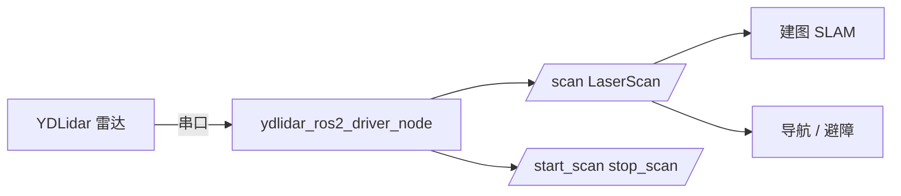

# ydlidar_ros2_driver — 激光雷达驱动说明书

> 适用版本：ROS2 Humble
> 维护：EAI / YDLidar（第三方开源驱动，MIT 协议）
> 功能：YDLidar 系列 2D 激光雷达的 ROS2 驱动，发布 `/scan` 激光数据

---

## 文件结构

```
src/ydlidar_ros2_driver/
├── src/
│   ├── ydlidar_ros2_driver_node.cpp    # ★ 驱动主节点
│   └── ydlidar_ros2_driver_client.cpp  # 调试客户端（打印 /scan 数据）
├── launch/
│   ├── ydlidar_launch.py      # ★ 常用启动（LifecycleNode + 自动 configure）
│   ├── ydlidar_launch_view.py # 启动 + RViz 可视化
│   └── ydlidar.py             # ros2run 方式启动 + TF 静态变换
├── params/                     # 各型号参数配置
│   ├── ydlidar.yaml            # 默认参数（frame=laser_frame）
│   ├── X4.yaml / X4-Pro.yaml / G1 / G2 / G6 / GS2 / TEA / TG / TminiPro / X2
├── startup/initenv.sh          # 串口权限初始化脚本
├── config/  images/  details.md
├── CMakeLists.txt  package.xml
└── README.md                   # 官方英文说明
```

> 依赖：`ydlidar_sdk`（YDLidar 官方 SDK）。若通过 apt 安装 `ros-humble-ydlidar-ros2-driver`，SDK 会作为依赖自动安装。

---

## 功能详细说明

### 1. 驱动主节点 `ydlidar_ros2_driver_node`

- 通过串口（默认 `/dev/ydlidar`）连接雷达，发布 `/scan`（`sensor_msgs/LaserScan`，SensorDataQoS）
- 支持三角测距（triangle）与 ToF 两类雷达（`lidar_type`）
- 支持 GS 系列多段工作模式参数（`m1_mode` / `m2_mode` / `m3_mode`）
- 提供扫描启停服务

### 2. 启动方式

```bash
# 方式一：默认参数启动（LifecycleNode 自动 configure）
ros2 launch ydlidar_ros2_driver ydlidar_launch.py

# 方式二：指定型号参数文件
ros2 launch ydlidar_ros2_driver ydlidar_launch.py \
  params_file:=/path/to/X4-Pro.yaml

# 方式三：启动并打开 RViz 查看
ros2 launch ydlidar_ros2_driver ydlidar_launch_view.py

# 方式四：初始化串口权限（首次使用，需 sudo）
sudo sh startup/initenv.sh
```

### 3. 在本项目（FOX 机器人）中的使用

本包在 `fox_slam_ros2` 中被集成，雷达 frame 为 **`front_lidar_link`**（与 URDF 一致）：

```bash
# fox_slam_ros2 提供的雷达 launch（使用 fox_lidar_params.yaml，frame=front_lidar_link）
ros2 launch fox_slam_ros2 fox_lidar.launch.py
```

> ⚠ **frame_id 一致性**：直接运行 `ydlidar_launch.py` 时默认 frame 为 `laser_frame`；而机器人 URDF 中的雷达坐标系是 `front_lidar_link`。若两者不一致，建图/导航会因缺少 TF 报错。建议：
> - 走 `fox_slam_ros2` 的建图/导航 launch（内部已按 `front_lidar_link` 启动雷达），或
> - 单独启动雷达时显式传入 `params_file:=<fox_slam_ros2>/config/fox_lidar_params.yaml`

> ⚠ **避免重复启动**：`fox_slam.launch.py`、`cartographer.launch.py`、`fox_navigation.launch.py` 内部都已包含雷达节点，**无需再手动单独启动雷达**。

### 4. 关键参数（`params/ydlidar.yaml`）

| 参数 | 默认值 | 说明 |
|------|--------|------|
| `port` | `/dev/ydlidar` | 串口设备 |
| `frame_id` | `laser_frame` | 激光数据坐标系 |
| `baudrate` | 115200 | 串口波特率 |
| `lidar_type` | 1 | 雷达类型（1=三角测距，ToF 用对应值） |
| `angle_min / angle_max` | -180 / 180 | 扫描角度范围（°） |
| `range_min / range_max` | 0.1 / 12.0 | 量程（m） |
| `frequency` | 10.0 | 扫描频率（Hz） |
| `sample_rate` | 3 | 采样率 |
| `intensity` / `intensity_bit` | false / 0 | 是否启用强度数据 |
| `reversion` / `inverted` | — | 旋转方向/镜像校正 |
| `auto_reconnect` | true | 断线自动重连 |
| `support_motor_dtr` | true | 电机 DTR 控制 |
| `invalid_range_is_inf` | false | 无效距离是否置为 inf |
| `m1/m2/m3_mode` | — | GS 系列工作模式 |

---

## 常用命令

```bash
# 启动雷达
ros2 launch ydlidar_ros2_driver ydlidar_launch.py

# 查看激光数据
ros2 topic echo /scan

# 用客户端节点打印角度-距离
ros2 run ydlidar_ros2_driver ydlidar_ros2_driver_client

# 停止 / 重启扫描
ros2 service call /stop_scan std_srvs/srv/Empty
ros2 service call /start_scan std_srvs/srv/Empty

# 查看 TF
ros2 run tf2_ros tf2_echo base_footprint front_lidar_link
```

---

## 话题

### 发布的话题

| 话题 | 类型 | 说明 |
|------|------|------|
| `/scan` | `sensor_msgs/LaserScan` | 2D 激光扫描数据（建图/导航/避障输入） |

### 服务一览

| 服务 | 类型 | 功能 |
|------|------|------|
| `/stop_scan` | `std_srvs/Empty` | 停止扫描 |
| `/start_scan` | `std_srvs/Empty` | 启动扫描 |

### 坐标系

- 雷达数据 frame：由 `frame_id` 参数决定（本项目为 `front_lidar_link`）
- 需保证 `base_footprint → front_lidar_link` 的 TF 存在（由 `robot_state_publisher` 根据 URDF 发布）

---

## 执行程序一览

| 程序 | 类型 | 功能 |
|------|------|------|
| `ydlidar_ros2_driver_node` | C++ | 雷达驱动主节点，发布 `/scan` |
| `ydlidar_ros2_driver_client` | C++ | 调试客户端，订阅并打印 `/scan` 角度-距离 |

---

## 简介

YDLidar 官方开源的 ROS2 驱动包（基于 `ydlidar_sdk`），用于将 YDLidar 系列 2D 激光雷达接入 ROS2，输出标准 `LaserScan` 数据供建图（SLAM Toolbox / Cartographer）、导航与避障使用。


